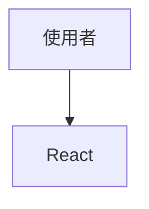

# SpecBook Renderer Implementation Plan

> **For agentic workers:** REQUIRED SUB-SKILL: Use superpowers:subagent-driven-development (recommended) or superpowers:executing-plans to implement this plan task-by-task. Steps use checkbox (`- [ ]`) syntax for tracking.

**Goal:** 建立 `specbook` npm 套件 — 將使用者專案 `.specbook/content/` 下的 5 個結構化檔案（md + yaml）轉成有節奏感的單頁靜態 SpecBook 站。

**Architecture:** Vite 6 + React 19 + Tailwind CSS 4 為核心。內容由 zod 驗證後送入 5 個專屬章節元件（HeroSection / StackGrid / ArchitectureBlock / StoryCardGrid / Timeline）渲染。Build 時用 `react-dom/server.renderToString` 預渲染整頁 HTML、build 時將 mermaid 區塊轉成 SVG，再 hydrate 極小 client bundle 提供 TOC scrollspy。Dev 模式走 Vite dev server + 自訂 plugin 監看 `.specbook/content/*` 觸發 HMR。

**Tech Stack:** TypeScript 5 / Vite 6 / React 19 / Tailwind CSS 4 / zod / gray-matter / yaml / mermaid-isomorphic / commander / jiti / vitest / @testing-library/react

**Scope note:** 本計畫對應 spec 中的 M1 + M2 + M5（renderer skeleton、content pipeline、deployment polish）。Spec 中的 M3 + M4（`/specbook init`、`/specbook enhance` skill）會由獨立計畫 `2026-05-02-specbook-skill.md` 處理，需在本計畫完成後才動工（skill 會 import 本套件的 schema）。

**Spec 來源:** `docs/superpowers/specs/2026-05-02-specbook-design.md`

---

## File Structure（事前定錨）

```
SpecBook/
├── package.json                    # 套件名 specbook、bin: { specbook }
├── tsconfig.json
├── vite.config.ts                  # 使用者預覽用設定（dev 模式）
├── vitest.config.ts
├── .gitignore
├── README.md
├── LICENSE                         # MIT
├── docs/
│   ├── DESIGN.md                   # 內部設計 token 文件
│   └── superpowers/                # 既存
├── src/
│   ├── index.ts                    # 套件對外 entry：export defineConfig + 型別
│   ├── cli/
│   │   ├── index.ts                # bin 入口、解析 dev|build|validate
│   │   ├── dev.ts
│   │   ├── build.ts
│   │   └── validate.ts
│   ├── schema/
│   │   ├── overview.ts
│   │   ├── tech-stack.ts
│   │   ├── architecture.ts
│   │   ├── user-stories.ts
│   │   ├── roadmap.ts
│   │   ├── config.ts
│   │   └── index.ts                # re-export 全部
│   ├── content/
│   │   ├── frontmatter.ts          # md frontmatter parser（gray-matter wrap）
│   │   ├── load-overview.ts
│   │   ├── load-tech-stack.ts
│   │   ├── load-architecture.ts
│   │   ├── load-user-stories.ts
│   │   ├── load-roadmap.ts
│   │   ├── load-config.ts          # 走 jiti
│   │   ├── load-all.ts
│   │   └── paths.ts                # .specbook/ 相對路徑解析
│   ├── components/
│   │   ├── Layout.tsx
│   │   ├── TocSidebar.tsx
│   │   ├── HeroSection.tsx
│   │   ├── StackGrid.tsx
│   │   ├── ArchitectureBlock.tsx
│   │   ├── StoryCardGrid.tsx
│   │   └── Timeline.tsx
│   ├── ssg/
│   │   ├── render-page.tsx         # SSR entry：renderToString
│   │   ├── client-entry.tsx        # hydrate 後啟動 scrollspy
│   │   ├── scrollspy.ts
│   │   └── mermaid-render.ts       # build-time mermaid → SVG
│   ├── styles/
│   │   ├── tokens.css              # Tailwind v4 @theme + accent CSS var
│   │   └── global.css              # @import "tailwindcss"; + 排版
│   ├── i18n/
│   │   ├── zh-TW.ts
│   │   ├── en.ts
│   │   └── index.ts
│   ├── plugins/
│   │   └── content-hmr.ts          # Vite plugin：監看 content/*
│   └── types.ts
├── tests/
│   ├── schema/                     # 5 個 schema 測試
│   ├── content/                    # loader 測試
│   ├── ssg/                        # SSG 與 mermaid 測試
│   └── fixtures/
│       └── taskflow/               # 整套 TaskFlow 測試 fixture
│           ├── specbook.config.ts
│           ├── content/{overview.md, tech-stack.yaml, ...}
│           └── assets/.gitkeep
└── examples/
    └── taskflow/                   # 給 `pnpm dev` 預覽用（同 fixture）
```

**檔案職責原則：** 每個檔 < 300 行；schema 與 loader 一章一檔；元件一個一檔；CLI 三個子命令分檔。

---

### Task 1: 專案初始化（package.json + TypeScript + 目錄骨架）

**Files:**
- Create: `package.json`
- Create: `tsconfig.json`
- Create: `.gitignore`
- Create: `LICENSE` (MIT)
- Create: `src/index.ts`
- Create: `src/types.ts`

- [ ] **Step 1: 初始化 package.json**

```bash
cd /Users/carl/Dev/CMG/SpecBook
pnpm init
```

接著手動編輯 `package.json` 為下列內容（保留 `pnpm init` 自動填入的 `packageManager`）：

```json
{
  "name": "specbook",
  "version": "0.1.0",
  "description": "Static site generator for software project specifications.",
  "type": "module",
  "license": "MIT",
  "bin": {
    "specbook": "./dist/cli/index.js"
  },
  "main": "./dist/index.js",
  "types": "./dist/index.d.ts",
  "exports": {
    ".": {
      "types": "./dist/index.d.ts",
      "import": "./dist/index.js"
    }
  },
  "files": ["dist", "README.md", "LICENSE"],
  "scripts": {
    "dev": "vite --config vite.config.ts examples/taskflow",
    "build": "tsc -p tsconfig.json",
    "test": "vitest run",
    "test:watch": "vitest"
  },
  "engines": {
    "node": ">=20"
  }
}
```

- [ ] **Step 2: 建立 tsconfig.json**

```json
{
  "compilerOptions": {
    "target": "ES2022",
    "module": "ESNext",
    "moduleResolution": "bundler",
    "strict": true,
    "esModuleInterop": true,
    "skipLibCheck": true,
    "resolveJsonModule": true,
    "jsx": "react-jsx",
    "outDir": "dist",
    "declaration": true,
    "declarationMap": true,
    "sourceMap": true,
    "lib": ["ES2022", "DOM"],
    "types": ["node", "vitest/globals"],
    "isolatedModules": true,
    "noUncheckedIndexedAccess": true
  },
  "include": ["src/**/*"],
  "exclude": ["dist", "node_modules", "tests", "examples"]
}
```

- [ ] **Step 3: 建立 .gitignore**

```
node_modules/
dist/
.specbook/dist/
.superpowers/
*.log
.DS_Store
.vite/
coverage/
```

- [ ] **Step 4: 建立 LICENSE（MIT 樣板）**

```
MIT License

Copyright (c) 2026 Carl

Permission is hereby granted, free of charge, to any person obtaining a copy
of this software and associated documentation files (the "Software"), to deal
in the Software without restriction, including without limitation the rights
to use, copy, modify, merge, publish, distribute, sublicense, and/or sell
copies of the Software, and to permit persons to whom the Software is
furnished to do so, subject to the following conditions:

The above copyright notice and this permission notice shall be included in all
copies or substantial portions of the Software.

THE SOFTWARE IS PROVIDED "AS IS", WITHOUT WARRANTY OF ANY KIND, EXPRESS OR
IMPLIED, INCLUDING BUT NOT LIMITED TO THE WARRANTIES OF MERCHANTABILITY,
FITNESS FOR A PARTICULAR PURPOSE AND NONINFRINGEMENT. IN NO EVENT SHALL THE
AUTHORS OR COPYRIGHT HOLDERS BE LIABLE FOR ANY CLAIM, DAMAGES OR OTHER
LIABILITY, WHETHER IN AN ACTION OF CONTRACT, TORT OR OTHERWISE, ARISING FROM,
OUT OF OR IN CONNECTION WITH THE SOFTWARE OR THE USE OR OTHER DEALINGS IN THE
SOFTWARE.
```

- [ ] **Step 5: 建立 src/index.ts 與 src/types.ts 占位**

`src/index.ts`：
```ts
export { defineConfig } from './schema/config.js'
export type { SpecBookConfig } from './schema/config.js'
```

`src/types.ts`：
```ts
export type Locale = 'zh-TW' | 'en'
```

（`config.ts` 還沒建立 — 先讓 import 紅字，Task 8 補完。）

- [ ] **Step 6: 確認 TypeScript 能 parse（會報 module not found，預期）**

```bash
pnpm tsc --noEmit
```

Expected: `Cannot find module './schema/config.js'`（這代表 ts 設定通了，只差 schema 檔；下個 task 安裝相依後 build 會跑）。

- [ ] **Step 7: Commit**

```bash
git init
git add package.json tsconfig.json .gitignore LICENSE src/
git commit -m "chore: 初始化 specbook 套件骨架"
```

---

### Task 2: 安裝 React 19 + Vite 6 + Tailwind CSS 4 + 設計 token

**Files:**
- Modify: `package.json`
- Create: `vite.config.ts`
- Create: `src/styles/tokens.css`
- Create: `src/styles/global.css`

- [ ] **Step 1: 安裝 runtime + dev 相依**

```bash
pnpm add react@^19 react-dom@^19 zod commander jiti gray-matter yaml mermaid-isomorphic
pnpm add -D typescript@^5 vite@^6 @vitejs/plugin-react @types/react @types/react-dom @types/node tailwindcss@^4 @tailwindcss/vite vitest @vitest/ui @testing-library/react @testing-library/jest-dom jsdom happy-dom
```

- [ ] **Step 2: 建立 vite.config.ts**

```ts
import { defineConfig } from 'vite'
import react from '@vitejs/plugin-react'
import tailwindcss from '@tailwindcss/vite'

export default defineConfig({
  plugins: [react(), tailwindcss()],
})
```

- [ ] **Step 3: 建立 src/styles/tokens.css（Tailwind v4 @theme + 設計 token）**

```css
@import "tailwindcss";

@theme {
  --color-bg: #fafaf9;
  --color-surface: #ffffff;
  --color-text: #1c1917;
  --color-text-soft: #57534e;
  --color-text-mute: #a8a29e;
  --color-border: #e7e5e4;
  --color-accent: #4f46e5;
  --color-accent-soft: #eef2ff;
  --color-code-bg: #f5f5f4;
  --color-status-done: #16a34a;
  --color-status-active: #d97706;
  --color-status-future: #9ca3af;

  --font-sans: -apple-system, system-ui, "Helvetica Neue",
               "PingFang TC", "Microsoft JhengHei", sans-serif;
  --font-serif: "Iowan Old Style", "Palatino Linotype", Palatino,
                "Source Serif Pro", Georgia, serif;
  --font-mono: "JetBrains Mono", "SF Mono", Menlo, monospace;
}

:root {
  /* 由 specbook.config.ts 注入的覆寫變數，預設與 @theme 一致 */
  --accent: var(--color-accent);
  --accent-soft: var(--color-accent-soft);
}
```

- [ ] **Step 4: 建立 src/styles/global.css（基礎排版）**

```css
@import "./tokens.css";

* { box-sizing: border-box; margin: 0; padding: 0; }

html, body {
  background: var(--color-bg);
  color: var(--color-text);
  font-family: var(--font-sans);
  line-height: 1.65;
  -webkit-font-smoothing: antialiased;
}

.serif { font-family: var(--font-serif); font-weight: 500; }
.mono { font-family: var(--font-mono); }
```

- [ ] **Step 5: 確認 tsc 可成功編譯**

```bash
pnpm tsc --noEmit
```

Expected: 仍然 `Cannot find module './schema/config.js'`（schema 還沒做）。React/Vite 相依已可解析。

- [ ] **Step 6: Commit**

```bash
git add package.json pnpm-lock.yaml vite.config.ts src/styles/
git commit -m "chore: 安裝 React + Vite + Tailwind v4 並建立設計 token"
```

---

### Task 3: Vitest 測試環境

**Files:**
- Create: `vitest.config.ts`
- Create: `tests/setup.ts`
- Create: `tests/sanity.test.ts`

- [ ] **Step 1: 建立 vitest.config.ts**

```ts
import { defineConfig } from 'vitest/config'
import react from '@vitejs/plugin-react'

export default defineConfig({
  plugins: [react()],
  test: {
    globals: true,
    environment: 'jsdom',
    setupFiles: ['./tests/setup.ts'],
    include: ['tests/**/*.test.{ts,tsx}'],
  },
})
```

- [ ] **Step 2: 建立 tests/setup.ts**

```ts
import '@testing-library/jest-dom/vitest'
```

- [ ] **Step 3: 建立 tests/sanity.test.ts（驗證測試環境）**

```ts
import { describe, it, expect } from 'vitest'

describe('sanity', () => {
  it('runs', () => {
    expect(1 + 1).toBe(2)
  })
})
```

- [ ] **Step 4: 跑測試驗證 setup**

```bash
pnpm test
```

Expected: `1 passed`。

- [ ] **Step 5: Commit**

```bash
git add vitest.config.ts tests/
git commit -m "chore: 建立 vitest + jsdom 測試環境"
```

---

### Task 4: zod schema — Overview

**Files:**
- Create: `src/schema/overview.ts`
- Create: `tests/schema/overview.test.ts`

- [ ] **Step 1: 寫測試（先紅）**

`tests/schema/overview.test.ts`：
```ts
import { describe, it, expect } from 'vitest'
import { OverviewSchema } from '../../src/schema/overview'

describe('OverviewSchema', () => {
  it('accepts valid frontmatter + body', () => {
    const result = OverviewSchema.parse({
      tagline: '極簡待辦工具',
      title: 'TaskFlow',
      body: '多數待辦工具都在加功能...',
    })
    expect(result.title).toBe('TaskFlow')
    expect(result.tagline).toBe('極簡待辦工具')
  })

  it('rejects when tagline missing', () => {
    expect(() =>
      OverviewSchema.parse({ title: 'X', body: 'y' })
    ).toThrow()
  })

  it('rejects empty body', () => {
    expect(() =>
      OverviewSchema.parse({ tagline: 't', title: 'X', body: '' })
    ).toThrow()
  })
})
```

- [ ] **Step 2: 跑測試確認失敗**

```bash
pnpm test tests/schema/overview.test.ts
```

Expected: FAIL — `Cannot find module '.../schema/overview'`。

- [ ] **Step 3: 寫實作**

`src/schema/overview.ts`：
```ts
import { z } from 'zod'

export const OverviewSchema = z.object({
  tagline: z.string().min(1, 'tagline 不可為空'),
  title: z.string().min(1, 'title 不可為空'),
  body: z.string().min(1, 'overview body 不可為空'),
})

export type Overview = z.infer<typeof OverviewSchema>
```

- [ ] **Step 4: 跑測試確認通過**

```bash
pnpm test tests/schema/overview.test.ts
```

Expected: `3 passed`。

- [ ] **Step 5: Commit**

```bash
git add src/schema/overview.ts tests/schema/overview.test.ts
git commit -m "feat: 加入 Overview zod schema"
```

---

### Task 5: zod schema — Tech Stack

**Files:**
- Create: `src/schema/tech-stack.ts`
- Create: `tests/schema/tech-stack.test.ts`

- [ ] **Step 1: 寫測試**

```ts
import { describe, it, expect } from 'vitest'
import { TechStackSchema } from '../../src/schema/tech-stack'

describe('TechStackSchema', () => {
  it('accepts valid layered list', () => {
    const data = [
      {
        layer: 'Frontend',
        items: [
          { name: 'React', version: '19.0', role: 'UI 框架' },
          { name: 'Tailwind', role: '原子化樣式' },
        ],
      },
    ]
    const result = TechStackSchema.parse(data)
    expect(result[0].items[0].name).toBe('React')
  })

  it('requires items[].role', () => {
    expect(() =>
      TechStackSchema.parse([
        { layer: 'X', items: [{ name: 'Y' }] },
      ])
    ).toThrow()
  })

  it('rejects empty layers', () => {
    expect(() => TechStackSchema.parse([])).toThrow()
  })
})
```

- [ ] **Step 2: 跑測試確認失敗**

```bash
pnpm test tests/schema/tech-stack.test.ts
```

Expected: FAIL — module not found。

- [ ] **Step 3: 寫實作**

`src/schema/tech-stack.ts`：
```ts
import { z } from 'zod'

export const TechItemSchema = z.object({
  name: z.string().min(1),
  version: z.string().optional(),
  role: z.string().min(1, 'role 不可為空'),
  icon: z.string().optional(),
})

export const TechLayerSchema = z.object({
  layer: z.string().min(1),
  items: z.array(TechItemSchema).min(1, '每層至少一個 item'),
})

export const TechStackSchema = z
  .array(TechLayerSchema)
  .min(1, '至少需要一個技術分層')

export type TechItem = z.infer<typeof TechItemSchema>
export type TechLayer = z.infer<typeof TechLayerSchema>
export type TechStack = z.infer<typeof TechStackSchema>
```

- [ ] **Step 4: 跑測試確認通過**

```bash
pnpm test tests/schema/tech-stack.test.ts
```

Expected: `3 passed`。

- [ ] **Step 5: Commit**

```bash
git add src/schema/tech-stack.ts tests/schema/tech-stack.test.ts
git commit -m "feat: 加入 TechStack zod schema"
```

---

### Task 6: zod schema — Architecture

**Files:**
- Create: `src/schema/architecture.ts`
- Create: `tests/schema/architecture.test.ts`

- [ ] **Step 1: 寫測試**

```ts
import { describe, it, expect } from 'vitest'
import { ArchitectureSchema } from '../../src/schema/architecture'

describe('ArchitectureSchema', () => {
  it('accepts diagram=mermaid without image', () => {
    const r = ArchitectureSchema.parse({
      diagram: 'mermaid',
      body: 'graph TD\n A --> B',
    })
    expect(r.diagram).toBe('mermaid')
  })

  it('accepts diagram=image with image path', () => {
    const r = ArchitectureSchema.parse({
      diagram: 'image',
      image: './assets/arch.png',
      body: '見上圖',
    })
    expect(r.image).toBe('./assets/arch.png')
  })

  it('rejects diagram=image without image path', () => {
    expect(() =>
      ArchitectureSchema.parse({ diagram: 'image', body: 'x' })
    ).toThrow(/image/)
  })

  it('accepts diagram=none', () => {
    const r = ArchitectureSchema.parse({ diagram: 'none', body: '純文字' })
    expect(r.image).toBeUndefined()
  })
})
```

- [ ] **Step 2: 跑測試確認失敗**

```bash
pnpm test tests/schema/architecture.test.ts
```

Expected: FAIL — module not found。

- [ ] **Step 3: 寫實作（含 superRefine 處理 image 條件必填）**

`src/schema/architecture.ts`：
```ts
import { z } from 'zod'

export const ArchitectureSchema = z
  .object({
    diagram: z.enum(['mermaid', 'image', 'none']),
    image: z.string().optional(),
    body: z.string().min(1, 'architecture body 不可為空'),
  })
  .superRefine((val, ctx) => {
    if (val.diagram === 'image' && !val.image) {
      ctx.addIssue({
        code: z.ZodIssueCode.custom,
        message: 'diagram=image 時必須提供 image 路徑',
        path: ['image'],
      })
    }
  })

export type Architecture = z.infer<typeof ArchitectureSchema>
```

- [ ] **Step 4: 跑測試確認通過**

```bash
pnpm test tests/schema/architecture.test.ts
```

Expected: `4 passed`。

- [ ] **Step 5: Commit**

```bash
git add src/schema/architecture.ts tests/schema/architecture.test.ts
git commit -m "feat: 加入 Architecture zod schema"
```

---

### Task 7: zod schema — User Stories + Roadmap

**Files:**
- Create: `src/schema/user-stories.ts`
- Create: `src/schema/roadmap.ts`
- Create: `tests/schema/user-stories.test.ts`
- Create: `tests/schema/roadmap.test.ts`

- [ ] **Step 1: 寫 user-stories 測試**

```ts
import { describe, it, expect } from 'vitest'
import { UserStoriesSchema } from '../../src/schema/user-stories'

describe('UserStoriesSchema', () => {
  it('accepts valid stories with default priority p1', () => {
    const r = UserStoriesSchema.parse([
      { as: '開發者', want: '快速新增', soThat: '< 1 秒' },
    ])
    expect(r[0].priority).toBe('p1')
  })

  it('accepts explicit priorities', () => {
    const r = UserStoriesSchema.parse([
      { as: 'A', want: 'B', soThat: 'C', priority: 'p0' },
    ])
    expect(r[0].priority).toBe('p0')
  })

  it('rejects unknown priority', () => {
    expect(() =>
      UserStoriesSchema.parse([
        { as: 'A', want: 'B', soThat: 'C', priority: 'p9' },
      ])
    ).toThrow()
  })

  it('rejects empty list', () => {
    expect(() => UserStoriesSchema.parse([])).toThrow()
  })
})
```

- [ ] **Step 2: 寫 roadmap 測試**

```ts
import { describe, it, expect } from 'vitest'
import { RoadmapSchema } from '../../src/schema/roadmap'

describe('RoadmapSchema', () => {
  it('accepts milestones with done/active/future status', () => {
    const r = RoadmapSchema.parse([
      { title: 'M1', status: 'done', items: ['A'] },
      { title: 'M2', status: 'active', quarter: '2026 Q2', items: [] },
      { title: 'M3', status: 'future' },
    ])
    expect(r).toHaveLength(3)
  })

  it('rejects unknown status', () => {
    expect(() =>
      RoadmapSchema.parse([{ title: 'X', status: 'wip' }])
    ).toThrow()
  })

  it('rejects empty list', () => {
    expect(() => RoadmapSchema.parse([])).toThrow()
  })
})
```

- [ ] **Step 3: 跑測試確認失敗**

```bash
pnpm test tests/schema/user-stories.test.ts tests/schema/roadmap.test.ts
```

Expected: FAIL — module not found。

- [ ] **Step 4: 寫 user-stories 實作**

`src/schema/user-stories.ts`：
```ts
import { z } from 'zod'

export const PrioritySchema = z.enum(['p0', 'p1', 'p2'])

export const UserStorySchema = z.object({
  as: z.string().min(1),
  want: z.string().min(1),
  soThat: z.string().min(1),
  priority: PrioritySchema.default('p1'),
})

export const UserStoriesSchema = z.array(UserStorySchema).min(1)

export type Priority = z.infer<typeof PrioritySchema>
export type UserStory = z.infer<typeof UserStorySchema>
export type UserStories = z.infer<typeof UserStoriesSchema>
```

- [ ] **Step 5: 寫 roadmap 實作**

`src/schema/roadmap.ts`：
```ts
import { z } from 'zod'

export const MilestoneStatusSchema = z.enum(['done', 'active', 'future'])

export const MilestoneSchema = z.object({
  title: z.string().min(1),
  quarter: z.string().optional(),
  status: MilestoneStatusSchema,
  items: z.array(z.string().min(1)).optional().default([]),
})

export const RoadmapSchema = z.array(MilestoneSchema).min(1)

export type MilestoneStatus = z.infer<typeof MilestoneStatusSchema>
export type Milestone = z.infer<typeof MilestoneSchema>
export type Roadmap = z.infer<typeof RoadmapSchema>
```

- [ ] **Step 6: 跑測試確認通過**

```bash
pnpm test tests/schema/
```

Expected: 全部 schema 測試通過（前 4 個 schema 共約 14 cases）。

- [ ] **Step 7: Commit**

```bash
git add src/schema/user-stories.ts src/schema/roadmap.ts tests/schema/user-stories.test.ts tests/schema/roadmap.test.ts
git commit -m "feat: 加入 UserStories 與 Roadmap zod schema"
```

---

### Task 8: zod schema — Config + 整合 export

**Files:**
- Create: `src/schema/config.ts`
- Create: `src/schema/index.ts`
- Create: `tests/schema/config.test.ts`

- [ ] **Step 1: 寫測試**

```ts
import { describe, it, expect } from 'vitest'
import { SpecBookConfigSchema, defineConfig } from '../../src/schema/config'

describe('SpecBookConfigSchema', () => {
  it('accepts minimal config (only project.name)', () => {
    const r = SpecBookConfigSchema.parse({ project: { name: 'X' } })
    expect(r.theme.accent).toBe('#4f46e5')
    expect(r.theme.locale).toBe('zh-TW')
    expect(r.sections.order).toEqual([
      'overview',
      'tech-stack',
      'architecture',
      'user-stories',
      'roadmap',
    ])
  })

  it('accepts custom accent + hide list', () => {
    const r = SpecBookConfigSchema.parse({
      project: { name: 'X' },
      theme: { accent: '#ff0066', mode: 'auto', locale: 'en' },
      sections: { hide: ['user-stories'] },
    })
    expect(r.theme.accent).toBe('#ff0066')
    expect(r.sections.hide).toEqual(['user-stories'])
  })

  it('rejects unknown section name in order', () => {
    expect(() =>
      SpecBookConfigSchema.parse({
        project: { name: 'X' },
        sections: { order: ['overview', 'made-up'] },
      })
    ).toThrow()
  })

  it('defineConfig returns the same shape', () => {
    const cfg = defineConfig({ project: { name: 'X' } })
    expect(cfg.project.name).toBe('X')
  })
})
```

- [ ] **Step 2: 跑測試確認失敗**

```bash
pnpm test tests/schema/config.test.ts
```

Expected: FAIL — module not found。

- [ ] **Step 3: 寫實作**

`src/schema/config.ts`：
```ts
import { z } from 'zod'

export const SectionNameSchema = z.enum([
  'overview',
  'tech-stack',
  'architecture',
  'user-stories',
  'roadmap',
])

const DEFAULT_ORDER: z.infer<typeof SectionNameSchema>[] = [
  'overview',
  'tech-stack',
  'architecture',
  'user-stories',
  'roadmap',
]

export const SpecBookConfigSchema = z.object({
  project: z.object({
    name: z.string().min(1),
    description: z.string().optional(),
    url: z.string().url().optional(),
    favicon: z.string().optional(),
    ogImage: z.string().optional(),
  }),
  theme: z
    .object({
      accent: z.string().regex(/^#[0-9a-fA-F]{6}$/).default('#4f46e5'),
      mode: z.enum(['light', 'auto']).default('light'),
      locale: z.enum(['zh-TW', 'en']).default('zh-TW'),
    })
    .default({}),
  sections: z
    .object({
      order: z.array(SectionNameSchema).default(DEFAULT_ORDER),
      hide: z.array(SectionNameSchema).default([]),
    })
    .default({}),
})

export type SpecBookConfig = z.infer<typeof SpecBookConfigSchema>

export function defineConfig(cfg: z.input<typeof SpecBookConfigSchema>): SpecBookConfig {
  return SpecBookConfigSchema.parse(cfg)
}
```

`src/schema/index.ts`：
```ts
export * from './overview.js'
export * from './tech-stack.js'
export * from './architecture.js'
export * from './user-stories.js'
export * from './roadmap.js'
export * from './config.js'
```

- [ ] **Step 4: 跑測試確認通過**

```bash
pnpm test tests/schema/
```

Expected: 全部 schema 測試通過。

- [ ] **Step 5: 確認 src/index.ts 的 import 鏈現在能解析**

```bash
pnpm tsc --noEmit
```

Expected: PASS（沒有 module not found）。

- [ ] **Step 6: Commit**

```bash
git add src/schema/config.ts src/schema/index.ts tests/schema/config.test.ts
git commit -m "feat: 加入 SpecBookConfig schema 與 defineConfig 輔助"
```

---

### Task 9: Markdown loader（gray-matter 包裝）

**Files:**
- Create: `src/content/frontmatter.ts`
- Create: `src/content/load-overview.ts`
- Create: `src/content/load-architecture.ts`
- Create: `tests/content/load-overview.test.ts`
- Create: `tests/content/load-architecture.test.ts`
- Create: `tests/fixtures/taskflow/content/overview.md`
- Create: `tests/fixtures/taskflow/content/architecture.md`

- [ ] **Step 1: 建立測試 fixture（之後其他 task 也會用）**

`tests/fixtures/taskflow/content/overview.md`：
```markdown
---
tagline: 同步至雲端的極簡待辦工具
---

# TaskFlow

多數待辦工具都在加功能；專業使用者真正缺的是「快速進入、即時同步、出門也能離線」的體驗。
```

`tests/fixtures/taskflow/content/architecture.md`：
````markdown
---
diagram: mermaid
---

三層：UI → 本機儲存 → 雲端同步。


````

- [ ] **Step 2: 寫測試**

`tests/content/load-overview.test.ts`：
```ts
import { describe, it, expect } from 'vitest'
import { loadOverview } from '../../src/content/load-overview'
import { resolve } from 'node:path'

const FIXTURE = resolve(__dirname, '../fixtures/taskflow/content/overview.md')

describe('loadOverview', () => {
  it('extracts tagline + first H1 + body', async () => {
    const r = await loadOverview(FIXTURE)
    expect(r.tagline).toBe('同步至雲端的極簡待辦工具')
    expect(r.title).toBe('TaskFlow')
    expect(r.body).toContain('多數待辦工具')
  })

  it('throws when file missing', async () => {
    await expect(loadOverview('/no/such/file.md')).rejects.toThrow()
  })
})
```

`tests/content/load-architecture.test.ts`：
```ts
import { describe, it, expect } from 'vitest'
import { loadArchitecture } from '../../src/content/load-architecture'
import { resolve } from 'node:path'

const FIXTURE = resolve(__dirname, '../fixtures/taskflow/content/architecture.md')

describe('loadArchitecture', () => {
  it('parses frontmatter diagram + body', async () => {
    const r = await loadArchitecture(FIXTURE)
    expect(r.diagram).toBe('mermaid')
    expect(r.body).toContain('graph TD')
  })
})
```

- [ ] **Step 3: 跑測試確認失敗**

```bash
pnpm test tests/content/
```

Expected: FAIL — module not found。

- [ ] **Step 4: 寫 frontmatter helper**

`src/content/frontmatter.ts`：
```ts
import { readFile } from 'node:fs/promises'
import matter from 'gray-matter'

export async function readMarkdownFile(filePath: string): Promise<{
  data: Record<string, unknown>
  content: string
}> {
  const raw = await readFile(filePath, 'utf-8')
  const parsed = matter(raw)
  return { data: parsed.data ?? {}, content: parsed.content.trim() }
}

export function extractFirstH1(body: string): { title: string; rest: string } {
  const lines = body.split('\n')
  const idx = lines.findIndex((l) => /^#\s+/.test(l))
  if (idx === -1) return { title: '', rest: body }
  const title = lines[idx]!.replace(/^#\s+/, '').trim()
  const rest = [...lines.slice(0, idx), ...lines.slice(idx + 1)]
    .join('\n')
    .trim()
  return { title, rest }
}
```

- [ ] **Step 5: 寫 load-overview**

`src/content/load-overview.ts`：
```ts
import { OverviewSchema, type Overview } from '../schema/overview.js'
import { readMarkdownFile, extractFirstH1 } from './frontmatter.js'

export async function loadOverview(filePath: string): Promise<Overview> {
  const { data, content } = await readMarkdownFile(filePath)
  const { title, rest } = extractFirstH1(content)
  return OverviewSchema.parse({
    tagline: data.tagline,
    title,
    body: rest,
  })
}
```

- [ ] **Step 6: 寫 load-architecture**

`src/content/load-architecture.ts`：
```ts
import { ArchitectureSchema, type Architecture } from '../schema/architecture.js'
import { readMarkdownFile } from './frontmatter.js'

export async function loadArchitecture(filePath: string): Promise<Architecture> {
  const { data, content } = await readMarkdownFile(filePath)
  return ArchitectureSchema.parse({
    diagram: data.diagram ?? 'none',
    image: data.image,
    body: content,
  })
}
```

- [ ] **Step 7: 跑測試確認通過**

```bash
pnpm test tests/content/
```

Expected: 全部通過。

- [ ] **Step 8: Commit**

```bash
git add src/content/frontmatter.ts src/content/load-overview.ts src/content/load-architecture.ts tests/content/ tests/fixtures/taskflow/content/overview.md tests/fixtures/taskflow/content/architecture.md
git commit -m "feat: 加入 markdown 章節 loader（overview + architecture）"
```

---

### Task 10: YAML loader（tech-stack + user-stories + roadmap）

**Files:**
- Create: `src/content/load-tech-stack.ts`
- Create: `src/content/load-user-stories.ts`
- Create: `src/content/load-roadmap.ts`
- Create: `tests/content/load-yaml.test.ts`
- Create: `tests/fixtures/taskflow/content/tech-stack.yaml`
- Create: `tests/fixtures/taskflow/content/user-stories.yaml`
- Create: `tests/fixtures/taskflow/content/roadmap.yaml`

- [ ] **Step 1: 建立 fixture YAML 檔**

`tests/fixtures/taskflow/content/tech-stack.yaml`：
```yaml
- layer: Frontend
  items:
    - name: React
      version: "19.0"
      role: UI 元件框架
    - name: Tailwind CSS
      version: "4.0"
      role: 原子化樣式
- layer: Backend
  items:
    - name: Supabase
      version: "2.x"
      role: Postgres + Realtime
```

`tests/fixtures/taskflow/content/user-stories.yaml`：
```yaml
- as: 忙碌的開發者
  want: 按下 ⌘+N 立刻新增一筆待辦
  soThat: 打斷思緒的時間 < 1 秒
  priority: p0
- as: 通勤中的使用者
  want: 在沒網路時也能新增、編輯、勾選
  soThat: 回到網路時自動同步
  priority: p0
```

`tests/fixtures/taskflow/content/roadmap.yaml`：
```yaml
- title: M1 — Local MVP
  quarter: 2026 Q1
  status: done
  items:
    - 本機新增 / 編輯 / 完成
    - IndexedDB 持久化
- title: M2 — 雲端同步
  quarter: 2026 Q2
  status: active
  items:
    - Supabase 多裝置同步
```

- [ ] **Step 2: 寫測試**

`tests/content/load-yaml.test.ts`：
```ts
import { describe, it, expect } from 'vitest'
import { resolve } from 'node:path'
import { loadTechStack } from '../../src/content/load-tech-stack'
import { loadUserStories } from '../../src/content/load-user-stories'
import { loadRoadmap } from '../../src/content/load-roadmap'

const F = (name: string) =>
  resolve(__dirname, `../fixtures/taskflow/content/${name}`)

describe('YAML loaders', () => {
  it('loads tech-stack.yaml', async () => {
    const r = await loadTechStack(F('tech-stack.yaml'))
    expect(r[0].layer).toBe('Frontend')
    expect(r[0].items).toHaveLength(2)
  })

  it('loads user-stories.yaml', async () => {
    const r = await loadUserStories(F('user-stories.yaml'))
    expect(r).toHaveLength(2)
    expect(r[0].priority).toBe('p0')
  })

  it('loads roadmap.yaml', async () => {
    const r = await loadRoadmap(F('roadmap.yaml'))
    expect(r[0].status).toBe('done')
    expect(r[1].items).toContain('Supabase 多裝置同步')
  })

  it('reports zod error path on invalid yaml', async () => {
    await expect(
      loadTechStack(F('user-stories.yaml')) // 故意錯型別
    ).rejects.toThrow()
  })
})
```

- [ ] **Step 3: 跑測試確認失敗**

```bash
pnpm test tests/content/load-yaml.test.ts
```

Expected: FAIL — module not found。

- [ ] **Step 4: 寫實作**

`src/content/load-tech-stack.ts`：
```ts
import { readFile } from 'node:fs/promises'
import { parse as parseYaml } from 'yaml'
import { TechStackSchema, type TechStack } from '../schema/tech-stack.js'

export async function loadTechStack(filePath: string): Promise<TechStack> {
  const raw = await readFile(filePath, 'utf-8')
  const data = parseYaml(raw)
  return TechStackSchema.parse(data)
}
```

`src/content/load-user-stories.ts`：
```ts
import { readFile } from 'node:fs/promises'
import { parse as parseYaml } from 'yaml'
import { UserStoriesSchema, type UserStories } from '../schema/user-stories.js'

export async function loadUserStories(filePath: string): Promise<UserStories> {
  const raw = await readFile(filePath, 'utf-8')
  const data = parseYaml(raw)
  return UserStoriesSchema.parse(data)
}
```

`src/content/load-roadmap.ts`：
```ts
import { readFile } from 'node:fs/promises'
import { parse as parseYaml } from 'yaml'
import { RoadmapSchema, type Roadmap } from '../schema/roadmap.js'

export async function loadRoadmap(filePath: string): Promise<Roadmap> {
  const raw = await readFile(filePath, 'utf-8')
  const data = parseYaml(raw)
  return RoadmapSchema.parse(data)
}
```

- [ ] **Step 5: 跑測試確認通過**

```bash
pnpm test tests/content/load-yaml.test.ts
```

Expected: `4 passed`。

- [ ] **Step 6: Commit**

```bash
git add src/content/load-tech-stack.ts src/content/load-user-stories.ts src/content/load-roadmap.ts tests/content/load-yaml.test.ts tests/fixtures/taskflow/content/tech-stack.yaml tests/fixtures/taskflow/content/user-stories.yaml tests/fixtures/taskflow/content/roadmap.yaml
git commit -m "feat: 加入 yaml 章節 loader（tech-stack + user-stories + roadmap）"
```

---

### Task 11: Config loader（jiti 載入 .ts/.js）+ load-all 整合

**Files:**
- Create: `src/content/paths.ts`
- Create: `src/content/load-config.ts`
- Create: `src/content/load-all.ts`
- Create: `tests/content/load-config.test.ts`
- Create: `tests/content/load-all.test.ts`
- Create: `tests/fixtures/taskflow/specbook.config.ts`

- [ ] **Step 1: 建立 fixture config**

`tests/fixtures/taskflow/specbook.config.ts`：
```ts
import { defineConfig } from '../../../src/schema/config.js'

export default defineConfig({
  project: {
    name: 'TaskFlow',
    description: '同步至雲端的極簡待辦工具',
  },
  theme: {
    accent: '#4f46e5',
    locale: 'zh-TW',
  },
})
```

- [ ] **Step 2: 寫 paths helper**

`src/content/paths.ts`：
```ts
import { resolve } from 'node:path'

export interface ContentPaths {
  root: string                    // .specbook/ 絕對路徑
  config: string                  // specbook.config.ts
  contentDir: string              // .specbook/content
  assetsDir: string               // .specbook/assets
  files: {
    overview: string
    techStack: string
    architecture: string
    userStories: string
    roadmap: string
  }
}

export function resolvePaths(specbookRoot: string): ContentPaths {
  const root = resolve(specbookRoot)
  const contentDir = resolve(root, 'content')
  return {
    root,
    config: resolve(root, 'specbook.config.ts'),
    contentDir,
    assetsDir: resolve(root, 'assets'),
    files: {
      overview: resolve(contentDir, 'overview.md'),
      techStack: resolve(contentDir, 'tech-stack.yaml'),
      architecture: resolve(contentDir, 'architecture.md'),
      userStories: resolve(contentDir, 'user-stories.yaml'),
      roadmap: resolve(contentDir, 'roadmap.yaml'),
    },
  }
}

export function resolveAsset(specbookRoot: string, assetPath: string): string {
  // assetPath 為 './assets/foo.png'，相對 .specbook/ 解析
  if (assetPath.startsWith('/')) return assetPath
  return resolve(specbookRoot, assetPath)
}
```

- [ ] **Step 3: 寫 load-config（用 jiti）**

`src/content/load-config.ts`：
```ts
import { createJiti } from 'jiti'
import { SpecBookConfigSchema, type SpecBookConfig } from '../schema/config.js'

export async function loadConfig(configPath: string): Promise<SpecBookConfig> {
  const jiti = createJiti(import.meta.url, { interopDefault: true })
  const mod: any = await jiti.import(configPath)
  const raw = mod?.default ?? mod
  return SpecBookConfigSchema.parse(raw)
}
```

- [ ] **Step 4: 寫 load-config 測試**

`tests/content/load-config.test.ts`：
```ts
import { describe, it, expect } from 'vitest'
import { resolve } from 'node:path'
import { loadConfig } from '../../src/content/load-config'

const CONFIG = resolve(__dirname, '../fixtures/taskflow/specbook.config.ts')

describe('loadConfig', () => {
  it('loads .ts config via jiti and validates', async () => {
    const cfg = await loadConfig(CONFIG)
    expect(cfg.project.name).toBe('TaskFlow')
    expect(cfg.theme.locale).toBe('zh-TW')
  })

  it('throws on missing file', async () => {
    await expect(loadConfig('/no/such/specbook.config.ts')).rejects.toThrow()
  })
})
```

- [ ] **Step 5: 寫 load-all（總入口）**

`src/content/load-all.ts`：
```ts
import { loadOverview } from './load-overview.js'
import { loadTechStack } from './load-tech-stack.js'
import { loadArchitecture } from './load-architecture.js'
import { loadUserStories } from './load-user-stories.js'
import { loadRoadmap } from './load-roadmap.js'
import { loadConfig } from './load-config.js'
import { resolvePaths, type ContentPaths } from './paths.js'
import type { Overview } from '../schema/overview.js'
import type { TechStack } from '../schema/tech-stack.js'
import type { Architecture } from '../schema/architecture.js'
import type { UserStories } from '../schema/user-stories.js'
import type { Roadmap } from '../schema/roadmap.js'
import type { SpecBookConfig } from '../schema/config.js'

export interface SpecBookData {
  config: SpecBookConfig
  overview: Overview
  techStack: TechStack
  architecture: Architecture
  userStories: UserStories
  roadmap: Roadmap
  paths: ContentPaths
}

export async function loadAll(specbookRoot: string): Promise<SpecBookData> {
  const paths = resolvePaths(specbookRoot)
  const [config, overview, techStack, architecture, userStories, roadmap] =
    await Promise.all([
      loadConfig(paths.config),
      loadOverview(paths.files.overview),
      loadTechStack(paths.files.techStack),
      loadArchitecture(paths.files.architecture),
      loadUserStories(paths.files.userStories),
      loadRoadmap(paths.files.roadmap),
    ])
  return { config, overview, techStack, architecture, userStories, roadmap, paths }
}
```

- [ ] **Step 6: 寫 load-all 測試**

`tests/content/load-all.test.ts`：
```ts
import { describe, it, expect } from 'vitest'
import { resolve } from 'node:path'
import { loadAll } from '../../src/content/load-all'

const ROOT = resolve(__dirname, '../fixtures/taskflow')

describe('loadAll', () => {
  it('loads full TaskFlow fixture', async () => {
    const data = await loadAll(ROOT)
    expect(data.config.project.name).toBe('TaskFlow')
    expect(data.overview.title).toBe('TaskFlow')
    expect(data.techStack[0].layer).toBe('Frontend')
    expect(data.architecture.diagram).toBe('mermaid')
    expect(data.userStories).toHaveLength(2)
    expect(data.roadmap[0].status).toBe('done')
  })
})
```

- [ ] **Step 7: 跑測試**

```bash
pnpm test tests/content/
```

Expected: 全部通過。

- [ ] **Step 8: Commit**

```bash
git add src/content/paths.ts src/content/load-config.ts src/content/load-all.ts tests/content/load-config.test.ts tests/content/load-all.test.ts tests/fixtures/taskflow/specbook.config.ts
git commit -m "feat: 加入 config loader（jiti）與 load-all 整合"
```

---

### Task 12: i18n 字串（zh-TW / en）

**Files:**
- Create: `src/i18n/zh-TW.ts`
- Create: `src/i18n/en.ts`
- Create: `src/i18n/index.ts`
- Create: `tests/i18n.test.ts`

- [ ] **Step 1: 寫測試**

```ts
import { describe, it, expect } from 'vitest'
import { getStrings } from '../src/i18n'

describe('i18n', () => {
  it('returns zh-TW strings', () => {
    const s = getStrings('zh-TW')
    expect(s.toc).toBe('目錄')
    expect(s.chapters.overview).toBe('Overview')
    expect(s.statuses.done).toBe('完成')
    expect(s.statuses.active).toBe('進行中')
  })

  it('returns en strings', () => {
    const s = getStrings('en')
    expect(s.toc).toBe('Contents')
    expect(s.statuses.done).toBe('Done')
  })
})
```

- [ ] **Step 2: 跑測試確認失敗**

```bash
pnpm test tests/i18n.test.ts
```

Expected: FAIL — module not found。

- [ ] **Step 3: 寫實作**

`src/i18n/zh-TW.ts`：
```ts
export const zhTW = {
  toc: '目錄',
  chapters: {
    overview: 'Overview',
    'tech-stack': 'Tech Stack',
    architecture: 'Architecture',
    'user-stories': 'User Stories',
    roadmap: 'Roadmap',
  },
  labels: {
    as: '身為',
    soThat: '以便',
    layer: '層',
  },
  statuses: {
    done: '完成',
    active: '進行中',
    future: '規劃',
  },
  footer: 'Generated by SpecBook',
} as const

export type Strings = typeof zhTW
```

`src/i18n/en.ts`：
```ts
import type { Strings } from './zh-TW.js'

export const en: Strings = {
  toc: 'Contents',
  chapters: {
    overview: 'Overview',
    'tech-stack': 'Tech Stack',
    architecture: 'Architecture',
    'user-stories': 'User Stories',
    roadmap: 'Roadmap',
  },
  labels: {
    as: 'As a',
    soThat: 'so that',
    layer: 'Layer',
  },
  statuses: {
    done: 'Done',
    active: 'In Progress',
    future: 'Planned',
  },
  footer: 'Generated by SpecBook',
}
```

`src/i18n/index.ts`：
```ts
import { zhTW } from './zh-TW.js'
import { en } from './en.js'
import type { Locale } from '../types.js'
export type { Strings } from './zh-TW.js'

export function getStrings(locale: Locale) {
  return locale === 'en' ? en : zhTW
}
```

- [ ] **Step 4: 跑測試確認通過**

```bash
pnpm test tests/i18n.test.ts
```

Expected: `2 passed`。

- [ ] **Step 5: Commit**

```bash
git add src/i18n/ tests/i18n.test.ts
git commit -m "feat: 加入 i18n 字串（zh-TW / en）"
```

---

### Task 13: <HeroSection> 元件

**Files:**
- Create: `src/components/HeroSection.tsx`
- Create: `tests/components/HeroSection.test.tsx`
- Modify: `src/styles/global.css`

- [ ] **Step 1: 寫測試**

```tsx
import { describe, it, expect } from 'vitest'
import { render, screen } from '@testing-library/react'
import { HeroSection } from '../../src/components/HeroSection'

describe('<HeroSection>', () => {
  const overview = {
    tagline: '極簡待辦',
    title: 'TaskFlow',
    body: '多數待辦工具都在加功能...',
  }

  it('renders title, tagline, problem body', () => {
    render(<HeroSection overview={overview} chapterLabel="Chapter 01 / Overview" />)
    expect(screen.getByRole('heading', { level: 1 })).toHaveTextContent('TaskFlow')
    expect(screen.getByText('極簡待辦')).toBeInTheDocument()
    expect(screen.getByText(/多數待辦工具/)).toBeInTheDocument()
  })

  it('uses id="overview" for anchor', () => {
    const { container } = render(
      <HeroSection overview={overview} chapterLabel="" />
    )
    expect(container.querySelector('section#overview')).not.toBeNull()
  })
})
```

- [ ] **Step 2: 跑測試確認失敗**

```bash
pnpm test tests/components/HeroSection.test.tsx
```

Expected: FAIL — module not found。

- [ ] **Step 3: 寫實作（視覺對齊 mockup）**

`src/components/HeroSection.tsx`：
```tsx
import type { Overview } from '../schema/overview.js'

interface Props {
  overview: Overview
  chapterLabel: string
}

export function HeroSection({ overview, chapterLabel }: Props) {
  return (
    <section id="overview" className="hero">
      <div className="chapter-num">— {chapterLabel} —</div>
      <h1 className="serif">{overview.title}</h1>
      <p className="tagline">{overview.tagline}</p>
      <div className="problem">{overview.body}</div>
    </section>
  )
}
```

對應的 CSS append 到 `src/styles/global.css`：
```css
.chapter-num {
  font-family: var(--font-serif);
  font-size: 13px;
  letter-spacing: 0.15em;
  color: var(--color-text-mute);
  text-transform: uppercase;
  margin-bottom: 16px;
  font-style: italic;
}

.hero h1 { font-size: 76px; line-height: 1.05; letter-spacing: -0.03em; margin: 8px 0 24px; }
.hero .tagline { font-size: 22px; color: var(--color-text-soft); max-width: 640px; margin-bottom: 48px; line-height: 1.5; }
.hero .problem {
  border-left: 3px solid var(--accent);
  padding: 8px 0 8px 24px;
  font-style: italic;
  color: var(--color-text-soft);
  font-size: 18px;
  max-width: 640px;
}
```

- [ ] **Step 4: 跑測試確認通過**

```bash
pnpm test tests/components/HeroSection.test.tsx
```

Expected: `2 passed`。

- [ ] **Step 5: Commit**

```bash
git add src/components/HeroSection.tsx src/styles/global.css tests/components/HeroSection.test.tsx
git commit -m "feat: 加入 HeroSection 元件"
```

---

### Task 14: <StackGrid> 元件

**Files:**
- Create: `src/components/StackGrid.tsx`
- Create: `tests/components/StackGrid.test.tsx`
- Modify: `src/styles/global.css`

- [ ] **Step 1: 寫測試**

```tsx
import { describe, it, expect } from 'vitest'
import { render, screen } from '@testing-library/react'
import { StackGrid } from '../../src/components/StackGrid'

describe('<StackGrid>', () => {
  const data = [
    {
      layer: 'Frontend',
      items: [
        { name: 'React', version: '19.0', role: 'UI 框架' },
        { name: 'Tailwind', role: '原子化樣式' },
      ],
    },
    { layer: 'Backend', items: [{ name: 'Supabase', role: 'DB' }] },
  ]

  it('groups items by layer', () => {
    render(<StackGrid data={data} chapterLabel="" heading="Stack" />)
    expect(screen.getByText('Frontend')).toBeInTheDocument()
    expect(screen.getByText('Backend')).toBeInTheDocument()
  })

  it('renders item name + version + role', () => {
    render(<StackGrid data={data} chapterLabel="" heading="Stack" />)
    expect(screen.getByText('React')).toBeInTheDocument()
    expect(screen.getByText('19.0')).toBeInTheDocument()
    expect(screen.getByText('UI 框架')).toBeInTheDocument()
  })

  it('omits version when not provided', () => {
    render(<StackGrid data={data} chapterLabel="" heading="Stack" />)
    const tailwind = screen.getByText('Tailwind').closest('.tech-card')
    expect(tailwind?.querySelector('.version')).toBeNull()
  })
})
```

- [ ] **Step 2: 跑測試確認失敗**

```bash
pnpm test tests/components/StackGrid.test.tsx
```

Expected: FAIL — module not found。

- [ ] **Step 3: 寫實作**

`src/components/StackGrid.tsx`：
```tsx
import type { TechStack } from '../schema/tech-stack.js'

interface Props {
  data: TechStack
  chapterLabel: string
  heading: string
}

export function StackGrid({ data, chapterLabel, heading }: Props) {
  return (
    <section id="tech-stack">
      <div className="chapter-num">— {chapterLabel} —</div>
      <h2 className="serif">{heading}</h2>
      {data.map((layer) => (
        <div key={layer.layer}>
          <div className="layer-label">{layer.layer}</div>
          <div className="stack-grid">
            {layer.items.map((item) => (
              <div className="tech-card" key={item.name}>
                <div className="name">
                  {item.icon ? (
                    <span className="tech-icon">{item.icon}</span>
                  ) : (
                    <span className="tech-icon">{item.name[0]}</span>
                  )}
                  {item.name}
                  {item.version && <span className="version">{item.version}</span>}
                </div>
                <div className="role">{item.role}</div>
              </div>
            ))}
          </div>
        </div>
      ))}
    </section>
  )
}
```

對應 CSS append 到 `src/styles/global.css`（從 mockup 抓出）：
```css
.layer-label { font-size: 11px; text-transform: uppercase; letter-spacing: 0.14em; color: var(--color-text-mute); margin: 32px 0 16px; font-weight: 600; }
.layer-label:first-of-type { margin-top: 0; }
.stack-grid { display: grid; grid-template-columns: repeat(3, 1fr); gap: 16px; }
.tech-card { background: var(--color-surface); border: 1px solid var(--color-border); border-radius: 10px; padding: 20px; transition: all 0.18s; }
.tech-card:hover { border-color: var(--accent); box-shadow: 0 4px 12px rgba(79,70,229,0.06); transform: translateY(-1px); }
.tech-card .name { font-weight: 600; font-size: 15px; display: flex; align-items: center; gap: 8px; }
.tech-card .version { font-family: var(--font-mono); font-size: 11px; color: var(--color-text-mute); background: var(--color-code-bg); padding: 2px 6px; border-radius: 4px; margin-left: auto; }
.tech-card .role { color: var(--color-text-soft); font-size: 13px; margin-top: 8px; line-height: 1.55; }
.tech-icon { width: 22px; height: 22px; border-radius: 4px; background: var(--accent-soft); display: inline-flex; align-items: center; justify-content: center; font-size: 11px; color: var(--accent); font-weight: 700; flex-shrink: 0; }
```

- [ ] **Step 4: 跑測試確認通過**

```bash
pnpm test tests/components/StackGrid.test.tsx
```

Expected: `3 passed`。

- [ ] **Step 5: Commit**

```bash
git add src/components/StackGrid.tsx src/styles/global.css tests/components/StackGrid.test.tsx
git commit -m "feat: 加入 StackGrid 元件"
```

---

### Task 15: <ArchitectureBlock> 元件（mermaid 渲染由 build pipeline 注入）

**Files:**
- Create: `src/components/ArchitectureBlock.tsx`
- Create: `tests/components/ArchitectureBlock.test.tsx`
- Modify: `src/styles/global.css`

說明：mermaid 區塊會在 build pipeline（Task 21 的 mermaid-render）階段被預先轉成 SVG 字串塞回 body。本元件只負責「渲染最終的 body 字串」。dev 模式下 body 仍含 ```mermaid 區塊原始碼，會以 `<pre>` 顯示為純文字（過渡，Task 23 plugin 不在 dev 處理 mermaid，使用者見原文）。

- [ ] **Step 1: 寫測試**

```tsx
import { describe, it, expect } from 'vitest'
import { render, screen } from '@testing-library/react'
import { ArchitectureBlock } from '../../src/components/ArchitectureBlock'

describe('<ArchitectureBlock>', () => {
  it('renders prose body when diagram=none', () => {
    render(
      <ArchitectureBlock
        chapterLabel=""
        heading="Architecture"
        architecture={{ diagram: 'none', body: '三層：A → B → C。' }}
      />
    )
    expect(screen.getByText(/三層/)).toBeInTheDocument()
  })

  it('shows image when diagram=image', () => {
    const { container } = render(
      <ArchitectureBlock
        chapterLabel=""
        heading="Architecture"
        architecture={{
          diagram: 'image',
          image: './assets/arch.png',
          body: '見上圖',
        }}
      />
    )
    const img = container.querySelector('img')
    expect(img).not.toBeNull()
    expect(img?.getAttribute('alt')).toBe('Architecture diagram')
  })

  it('injects raw HTML when diagram=mermaid (already pre-rendered)', () => {
    const body = '<svg id="m1"><g></g></svg>'
    const { container } = render(
      <ArchitectureBlock
        chapterLabel=""
        heading="Architecture"
        architecture={{ diagram: 'mermaid', body }}
      />
    )
    expect(container.querySelector('#m1')).not.toBeNull()
  })
})
```

- [ ] **Step 2: 跑測試確認失敗**

```bash
pnpm test tests/components/ArchitectureBlock.test.tsx
```

Expected: FAIL — module not found。

- [ ] **Step 3: 寫實作**

`src/components/ArchitectureBlock.tsx`：
```tsx
import type { Architecture } from '../schema/architecture.js'

interface Props {
  architecture: Architecture
  chapterLabel: string
  heading: string
}

export function ArchitectureBlock({ architecture, chapterLabel, heading }: Props) {
  return (
    <section id="architecture">
      <div className="chapter-num">— {chapterLabel} —</div>
      <h2 className="serif">{heading}</h2>

      {architecture.diagram === 'image' && architecture.image && (
        <div className="diagram">
          
        </div>
      )}

      {architecture.diagram === 'mermaid' && (
        <div
          className="diagram mermaid-host"
          dangerouslySetInnerHTML={{ __html: architecture.body }}
        />
      )}

      {architecture.diagram === 'none' && (
        <div className="prose">{architecture.body}</div>
      )}
    </section>
  )
}
```

對應 CSS append 到 `src/styles/global.css`：
```css
.diagram { background: var(--color-surface); border: 1px solid var(--color-border); border-radius: 10px; padding: 40px; margin-bottom: 32px; display: flex; flex-direction: column; align-items: center; gap: 12px; }
.prose { color: var(--color-text-soft); font-size: 15px; line-height: 1.78; max-width: 680px; }
.prose p + p { margin-top: 16px; }
.prose strong { color: var(--color-text); }
.prose code { background: var(--color-code-bg); padding: 1px 6px; border-radius: 3px; font-size: 13px; font-family: var(--font-mono); }
```

- [ ] **Step 4: 跑測試確認通過**

```bash
pnpm test tests/components/ArchitectureBlock.test.tsx
```

Expected: `3 passed`。

- [ ] **Step 5: Commit**

```bash
git add src/components/ArchitectureBlock.tsx src/styles/global.css tests/components/ArchitectureBlock.test.tsx
git commit -m "feat: 加入 ArchitectureBlock 元件（mermaid 預留 body 注入點）"
```

---

### Task 16: <StoryCardGrid> 元件

**Files:**
- Create: `src/components/StoryCardGrid.tsx`
- Create: `tests/components/StoryCardGrid.test.tsx`
- Modify: `src/styles/global.css`

- [ ] **Step 1: 寫測試**

```tsx
import { describe, it, expect } from 'vitest'
import { render, screen } from '@testing-library/react'
import { StoryCardGrid } from '../../src/components/StoryCardGrid'

const stories = [
  { as: '開發者', want: '快速新增', soThat: '< 1 秒', priority: 'p0' as const },
  { as: '通勤者', want: '離線編輯', soThat: '回網自動同步', priority: 'p1' as const },
]

describe('<StoryCardGrid>', () => {
  it('renders one card per story', () => {
    const { container } = render(
      <StoryCardGrid
        stories={stories}
        chapterLabel=""
        heading="Stories"
        labels={{ as: '身為', soThat: '以便' }}
      />
    )
    expect(container.querySelectorAll('.story-card')).toHaveLength(2)
  })

  it('shows priority badge', () => {
    render(
      <StoryCardGrid
        stories={stories}
        chapterLabel=""
        heading="Stories"
        labels={{ as: '身為', soThat: '以便' }}
      />
    )
    expect(screen.getByText('P0')).toBeInTheDocument()
    expect(screen.getByText('P1')).toBeInTheDocument()
  })
})
```

- [ ] **Step 2: 跑測試確認失敗**

```bash
pnpm test tests/components/StoryCardGrid.test.tsx
```

Expected: FAIL — module not found。

- [ ] **Step 3: 寫實作**

`src/components/StoryCardGrid.tsx`：
```tsx
import type { UserStories } from '../schema/user-stories.js'

interface Props {
  stories: UserStories
  chapterLabel: string
  heading: string
  labels: { as: string; soThat: string }
}

export function StoryCardGrid({ stories, chapterLabel, heading, labels }: Props) {
  return (
    <section id="user-stories">
      <div className="chapter-num">— {chapterLabel} —</div>
      <h2 className="serif">{heading}</h2>
      <div className="story-grid">
        {stories.map((s, i) => (
          <div className="story-card" key={i}>
            <span className={`priority ${s.priority}`}>{s.priority.toUpperCase()}</span>
            <div className="as">{labels.as}</div>
            <div className="role-name">{s.as}</div>
            <div className="want">{s.want}</div>
            <div className="so-that">
              <span className="so-that-label">{labels.soThat}</span>
              {s.soThat}
            </div>
          </div>
        ))}
      </div>
    </section>
  )
}
```

對應 CSS append 到 `src/styles/global.css`：
```css
.story-grid { display: grid; grid-template-columns: 1fr 1fr; gap: 16px; }
.story-card { background: var(--color-surface); border: 1px solid var(--color-border); border-radius: 10px; padding: 24px; position: relative; }
.story-card .priority { position: absolute; top: 16px; right: 16px; font-size: 10px; letter-spacing: 0.1em; text-transform: uppercase; padding: 3px 8px; border-radius: 4px; font-weight: 600; }
.priority.p0 { background: #fee2e2; color: #b91c1c; }
.priority.p1 { background: #fef3c7; color: #b45309; }
.priority.p2 { background: var(--color-code-bg); color: var(--color-text-mute); }
.story-card .as { font-size: 11px; text-transform: uppercase; letter-spacing: 0.1em; color: var(--color-text-mute); margin-bottom: 4px; }
.story-card .role-name { font-weight: 600; font-size: 16px; margin-bottom: 16px; }
.story-card .want { font-size: 15px; color: var(--color-text); line-height: 1.6; }
.story-card .so-that-label { font-size: 11px; text-transform: uppercase; letter-spacing: 0.1em; color: var(--color-text-mute); display: block; margin-bottom: 4px; }
.story-card .so-that { font-size: 14px; color: var(--color-text-soft); border-top: 1px dashed var(--color-border); padding-top: 12px; margin-top: 16px; line-height: 1.55; }
```

- [ ] **Step 4: 跑測試確認通過**

```bash
pnpm test tests/components/StoryCardGrid.test.tsx
```

Expected: `2 passed`。

- [ ] **Step 5: Commit**

```bash
git add src/components/StoryCardGrid.tsx src/styles/global.css tests/components/StoryCardGrid.test.tsx
git commit -m "feat: 加入 StoryCardGrid 元件"
```

---

### Task 17: <Timeline> 元件

**Files:**
- Create: `src/components/Timeline.tsx`
- Create: `tests/components/Timeline.test.tsx`
- Modify: `src/styles/global.css`

- [ ] **Step 1: 寫測試**

```tsx
import { describe, it, expect } from 'vitest'
import { render, screen } from '@testing-library/react'
import { Timeline } from '../../src/components/Timeline'

const roadmap = [
  { title: 'M1', status: 'done' as const, quarter: '2026 Q1', items: ['A'] },
  { title: 'M2', status: 'active' as const, quarter: '2026 Q2', items: [] },
  { title: 'M3', status: 'future' as const, items: ['B', 'C'] },
]

describe('<Timeline>', () => {
  it('renders milestones with status class', () => {
    const { container } = render(
      <Timeline
        roadmap={roadmap}
        chapterLabel=""
        heading="Roadmap"
        statusLabels={{ done: '完成', active: '進行中', future: '規劃' }}
      />
    )
    expect(container.querySelectorAll('.milestone.done')).toHaveLength(1)
    expect(container.querySelectorAll('.milestone.active')).toHaveLength(1)
    expect(container.querySelectorAll('.milestone.future')).toHaveLength(1)
  })

  it('renders items', () => {
    render(
      <Timeline
        roadmap={roadmap}
        chapterLabel=""
        heading="Roadmap"
        statusLabels={{ done: '完成', active: '進行中', future: '規劃' }}
      />
    )
    expect(screen.getByText('A')).toBeInTheDocument()
    expect(screen.getByText('B')).toBeInTheDocument()
  })

  it('shows status label text', () => {
    render(
      <Timeline
        roadmap={roadmap}
        chapterLabel=""
        heading="Roadmap"
        statusLabels={{ done: '完成', active: '進行中', future: '規劃' }}
      />
    )
    expect(screen.getByText('完成')).toBeInTheDocument()
    expect(screen.getByText('進行中')).toBeInTheDocument()
  })
})
```

- [ ] **Step 2: 跑測試確認失敗**

```bash
pnpm test tests/components/Timeline.test.tsx
```

Expected: FAIL — module not found。

- [ ] **Step 3: 寫實作**

`src/components/Timeline.tsx`：
```tsx
import type { Roadmap, MilestoneStatus } from '../schema/roadmap.js'

interface Props {
  roadmap: Roadmap
  chapterLabel: string
  heading: string
  statusLabels: Record<MilestoneStatus, string>
}

export function Timeline({ roadmap, chapterLabel, heading, statusLabels }: Props) {
  return (
    <section id="roadmap">
      <div className="chapter-num">— {chapterLabel} —</div>
      <h2 className="serif">{heading}</h2>
      <div className="timeline">
        {roadmap.map((m, i) => (
          <div className={`milestone ${m.status}`} key={i}>
            <div className="milestone-header">
              <div className="milestone-title">{m.title}</div>
              {m.quarter && <span className="milestone-quarter">{m.quarter}</span>}
              <span className="milestone-status">{statusLabels[m.status]}</span>
            </div>
            {m.items.length > 0 && (
              <ul>
                {m.items.map((it, j) => (
                  <li key={j}>{it}</li>
                ))}
              </ul>
            )}
          </div>
        ))}
      </div>
    </section>
  )
}
```

對應 CSS append 到 `src/styles/global.css`：
```css
.timeline { position: relative; padding-left: 28px; }
.timeline::before { content: ''; position: absolute; left: 9px; top: 8px; bottom: 8px; width: 2px; background: var(--color-border); }
.milestone { position: relative; padding-bottom: 32px; }
.milestone:last-child { padding-bottom: 0; }
.milestone::before { content: ''; position: absolute; left: -23px; top: 6px; width: 12px; height: 12px; border-radius: 50%; background: var(--color-bg); border: 3px solid var(--color-status-future); }
.milestone.done::before { border-color: var(--color-status-done); background: var(--color-status-done); }
.milestone.active::before { border-color: var(--color-status-active); background: var(--color-status-active); box-shadow: 0 0 0 4px #fef3c7; }
.milestone-header { display: flex; align-items: baseline; gap: 12px; margin-bottom: 8px; flex-wrap: wrap; }
.milestone-title { font-weight: 600; font-size: 17px; }
.milestone-quarter { font-size: 12px; font-family: var(--font-mono); color: var(--color-text-mute); }
.milestone-status { font-size: 10px; padding: 2px 8px; border-radius: 4px; text-transform: uppercase; letter-spacing: 0.08em; font-weight: 600; }
.milestone.done .milestone-status { background: #dcfce7; color: #166534; }
.milestone.active .milestone-status { background: #fef3c7; color: #92400e; }
.milestone.future .milestone-status { background: var(--color-code-bg); color: var(--color-text-mute); }
.milestone ul { margin-top: 8px; padding-left: 18px; color: var(--color-text-soft); font-size: 14px; }
.milestone li { padding: 2px 0; }
```

- [ ] **Step 4: 跑測試確認通過**

```bash
pnpm test tests/components/Timeline.test.tsx
```

Expected: `3 passed`。

- [ ] **Step 5: Commit**

```bash
git add src/components/Timeline.tsx src/styles/global.css tests/components/Timeline.test.tsx
git commit -m "feat: 加入 Timeline 元件"
```

---

### Task 18: <Layout> + <TocSidebar> + 整合 <SpecBookPage>

**Files:**
- Create: `src/components/TocSidebar.tsx`
- Create: `src/components/Layout.tsx`
- Create: `src/components/SpecBookPage.tsx`
- Create: `tests/components/SpecBookPage.test.tsx`
- Modify: `src/styles/global.css`

- [ ] **Step 1: 寫整合測試**

```tsx
import { describe, it, expect } from 'vitest'
import { render, screen } from '@testing-library/react'
import { SpecBookPage } from '../../src/components/SpecBookPage'
import { resolve } from 'node:path'
import { loadAll } from '../../src/content/load-all'

describe('<SpecBookPage>', () => {
  it('renders all 5 sections from TaskFlow fixture', async () => {
    const data = await loadAll(resolve(__dirname, '../fixtures/taskflow'))
    const { container } = render(<SpecBookPage data={data} />)
    expect(container.querySelector('section#overview')).not.toBeNull()
    expect(container.querySelector('section#tech-stack')).not.toBeNull()
    expect(container.querySelector('section#architecture')).not.toBeNull()
    expect(container.querySelector('section#user-stories')).not.toBeNull()
    expect(container.querySelector('section#roadmap')).not.toBeNull()
  })

  it('respects sections.hide (skips hidden section)', async () => {
    const data = await loadAll(resolve(__dirname, '../fixtures/taskflow'))
    const hidden = {
      ...data,
      config: {
        ...data.config,
        sections: { ...data.config.sections, hide: ['user-stories' as const] },
      },
    }
    const { container } = render(<SpecBookPage data={hidden} />)
    expect(container.querySelector('section#user-stories')).toBeNull()
  })

  it('TOC labels reflect locale', async () => {
    const data = await loadAll(resolve(__dirname, '../fixtures/taskflow'))
    render(<SpecBookPage data={data} />)
    expect(screen.getByText('目錄')).toBeInTheDocument()
  })
})
```

- [ ] **Step 2: 跑測試確認失敗**

```bash
pnpm test tests/components/SpecBookPage.test.tsx
```

Expected: FAIL — module not found。

- [ ] **Step 3: 寫 TocSidebar**

`src/components/TocSidebar.tsx`：
```tsx
import type { Strings } from '../i18n/index.js'
import type { SpecBookConfig } from '../schema/config.js'

interface Props {
  strings: Strings
  sections: SpecBookConfig['sections']['order']
}

export function TocSidebar({ strings, sections }: Props) {
  return (
    <aside className="toc">
      <div className="toc-label">{strings.toc}</div>
      <ul className="toc-list" data-toc="">
        {sections.map((s, i) => (
          <li key={s} data-toc-target={s}>
            {String(i + 1).padStart(2, '0')} · {strings.chapters[s]}
          </li>
        ))}
      </ul>
    </aside>
  )
}
```

- [ ] **Step 4: 寫 Layout**

`src/components/Layout.tsx`：
```tsx
import type { ReactNode, CSSProperties } from 'react'

interface Props {
  children: ReactNode
  toc: ReactNode
  accent: string
  footerText: string
}

export function Layout({ children, toc, accent, footerText }: Props) {
  const style = { ['--accent' as string]: accent } as CSSProperties
  return (
    <div className="layout" style={style}>
      <main className="main">
        {children}
        <div className="footer">{footerText}</div>
      </main>
      {toc}
    </div>
  )
}
```

- [ ] **Step 5: 寫 SpecBookPage（整合）**

`src/components/SpecBookPage.tsx`：
```tsx
import type { SpecBookData } from '../content/load-all.js'
import { getStrings } from '../i18n/index.js'
import { HeroSection } from './HeroSection.js'
import { StackGrid } from './StackGrid.js'
import { ArchitectureBlock } from './ArchitectureBlock.js'
import { StoryCardGrid } from './StoryCardGrid.js'
import { Timeline } from './Timeline.js'
import { Layout } from './Layout.js'
import { TocSidebar } from './TocSidebar.js'

interface Props {
  data: SpecBookData
}

export function SpecBookPage({ data }: Props) {
  const { config, overview, techStack, architecture, userStories, roadmap } = data
  const strings = getStrings(config.theme.locale)
  const visibleOrder = config.sections.order.filter(
    (s) => !config.sections.hide.includes(s)
  )

  const labelOf = (s: typeof visibleOrder[number]) => {
    const idx = visibleOrder.indexOf(s)
    return `Chapter ${String(idx + 1).padStart(2, '0')} / ${strings.chapters[s]}`
  }

  const renderSection = (s: typeof visibleOrder[number]) => {
    switch (s) {
      case 'overview':
        return <HeroSection key={s} overview={overview} chapterLabel={labelOf(s)} />
      case 'tech-stack':
        return (
          <StackGrid
            key={s}
            data={techStack}
            chapterLabel={labelOf(s)}
            heading={strings.chapters['tech-stack']}
          />
        )
      case 'architecture':
        return (
          <ArchitectureBlock
            key={s}
            architecture={architecture}
            chapterLabel={labelOf(s)}
            heading={strings.chapters.architecture}
          />
        )
      case 'user-stories':
        return (
          <StoryCardGrid
            key={s}
            stories={userStories}
            chapterLabel={labelOf(s)}
            heading={strings.chapters['user-stories']}
            labels={{ as: strings.labels.as, soThat: strings.labels.soThat }}
          />
        )
      case 'roadmap':
        return (
          <Timeline
            key={s}
            roadmap={roadmap}
            chapterLabel={labelOf(s)}
            heading={strings.chapters.roadmap}
            statusLabels={strings.statuses}
          />
        )
    }
  }

  return (
    <Layout
      accent={config.theme.accent}
      toc={<TocSidebar strings={strings} sections={visibleOrder} />}
      footerText={`${strings.footer} · npx specbook build`}
    >
      {visibleOrder.map(renderSection)}
    </Layout>
  )
}
```

- [ ] **Step 6: 補 Layout/Toc CSS append 到 `src/styles/global.css`**

```css
.layout { max-width: 1200px; margin: 0 auto; padding: 0 48px; display: grid; grid-template-columns: 1fr 220px; gap: 64px; }
.main { padding: 80px 0; }
section { padding: 80px 0; border-bottom: 1px solid var(--color-border); }
section:last-child { border-bottom: none; }
section:first-child { padding-top: 0; }
section h2 { font-size: 40px; letter-spacing: -0.02em; margin-bottom: 12px; line-height: 1.2; }
section .lead { color: var(--color-text-soft); font-size: 16px; max-width: 560px; margin-bottom: 40px; line-height: 1.6; }

.toc { padding: 80px 0; position: sticky; top: 0; align-self: start; height: fit-content; }
.toc-list { list-style: none; border-left: 1px solid var(--color-border); padding-left: 18px; }
.toc-list li { padding: 6px 0; font-size: 13px; color: var(--color-text-mute); position: relative; cursor: pointer; }
.toc-list li.active { color: var(--accent); font-weight: 500; }
.toc-list li.active::before { content: ''; position: absolute; left: -19px; top: 11px; width: 8px; height: 8px; background: var(--accent); border-radius: 50%; }
.toc-label { font-size: 11px; text-transform: uppercase; letter-spacing: 0.12em; color: var(--color-text-mute); margin-bottom: 12px; font-weight: 600; }

.footer { padding: 48px 0; color: var(--color-text-mute); font-size: 13px; text-align: center; border-top: 1px solid var(--color-border); margin-top: 48px; font-family: var(--font-mono); }
```

- [ ] **Step 7: 跑測試確認通過**

```bash
pnpm test tests/components/SpecBookPage.test.tsx
```

Expected: `3 passed`。

- [ ] **Step 8: Commit**

```bash
git add src/components/Layout.tsx src/components/TocSidebar.tsx src/components/SpecBookPage.tsx src/styles/global.css tests/components/SpecBookPage.test.tsx
git commit -m "feat: 整合 SpecBookPage（5 章 + TOC + Layout）"
```

---

### Task 19: 範例 fixture 完整化 + dev 環境可預覽

**Files:**
- Create: `examples/taskflow/specbook.config.ts`
- Create: `examples/taskflow/content/{overview.md, tech-stack.yaml, architecture.md, user-stories.yaml, roadmap.yaml}`
- Create: `examples/taskflow/index.html`
- Create: `examples/taskflow/main.tsx`
- Create: `src/dev/dev-data-stub.ts`（過渡，Task 23 刪除）

說明：這個 task 的目的是「在還沒接 CLI 之前，就讓 `pnpm dev` 能透過 Vite 跑起來看到 TaskFlow 站」。它驗證所有元件 + loader 的整合，是 M1 的視覺驗收點。

- [ ] **Step 1: 把 fixture 內容複製進 examples，並把 user-stories 補到 4 筆、roadmap 補到 4 筆**

`examples/taskflow/specbook.config.ts`：
```ts
import { defineConfig } from '../../src/schema/config.js'

export default defineConfig({
  project: {
    name: 'TaskFlow',
    description: '同步至雲端的極簡待辦工具',
  },
  theme: { accent: '#4f46e5', locale: 'zh-TW' },
})
```

`examples/taskflow/content/overview.md`、`tech-stack.yaml`、`architecture.md`：與 `tests/fixtures/taskflow/content/` 的同名檔內容相同（直接複製）。

`examples/taskflow/content/user-stories.yaml`：
```yaml
- as: 忙碌的開發者
  want: 按下 ⌘+N 立刻新增一筆待辦
  soThat: 打斷思緒的時間 < 1 秒
  priority: p0
- as: 通勤中的使用者
  want: 在沒網路時也能新增、編輯、勾選待辦
  soThat: 回到網路時自動同步、不丟資料
  priority: p0
- as: 多裝置使用者
  want: 在 Mac 與手機間即時看到變動
  soThat: 不需要手動 refresh 或重新登入
  priority: p1
- as: 視覺整理控
  want: 用 tag 分組待辦並收合次要群組
  soThat: 眼前永遠只剩重要的事
  priority: p2
```

`examples/taskflow/content/roadmap.yaml`：
```yaml
- title: M1 — Local MVP
  quarter: 2026 Q1
  status: done
  items:
    - 本機新增 / 編輯 / 完成
    - IndexedDB 持久化
    - 鍵盤優先操作
- title: M2 — 雲端同步
  quarter: 2026 Q2
  status: active
  items:
    - Supabase 帳號 + 多裝置同步
    - 離線佇列與衝突解決
    - Realtime push 更新
- title: M3 — 共享清單
  quarter: 2026 Q3
  status: future
  items:
    - 列表分享連結 + 權限
- title: M4 — Public API
  quarter: 2026 Q4
  status: future
  items:
    - 第三方整合（Raycast、Alfred）
    - OAuth + rate limit
```

- [ ] **Step 2: 建立 examples/taskflow/index.html + main.tsx**

`examples/taskflow/index.html`：
```html
<!DOCTYPE html>
<html lang="zh-TW">
<head>
  <meta charset="UTF-8" />
  <meta name="viewport" content="width=device-width, initial-scale=1.0" />
  <title>TaskFlow — SpecBook</title>
</head>
<body>
  <div id="root"></div>
  <script type="module" src="./main.tsx"></script>
</body>
</html>
```

`examples/taskflow/main.tsx`（過渡版本，Task 23 改用 virtual:specbook-data）：
```tsx
import React from 'react'
import { createRoot } from 'react-dom/client'
import '../../src/styles/global.css'
import { SpecBookPage } from '../../src/components/SpecBookPage.js'
import { examplesData } from '../../src/dev/dev-data-stub.js'

const root = createRoot(document.getElementById('root')!)
root.render(<SpecBookPage data={examplesData} />)
```

- [ ] **Step 3: 建立過渡 stub**

`src/dev/dev-data-stub.ts`：
```ts
// 過渡用：Task 23 寫完 Vite plugin 後刪掉
import { loadAll } from '../content/load-all.js'
import { resolve } from 'node:path'

export const examplesData = await loadAll(
  resolve(process.cwd(), 'examples/taskflow')
)
```

並調整 `package.json` 的 `scripts.dev` 確認 vite root 對：
```json
"dev": "vite examples/taskflow"
```

- [ ] **Step 4: 跑 `pnpm dev`，瀏覽器打開 http://localhost:5173 驗收**

```bash
pnpm dev
```

Expected: 看到 TaskFlow SpecBook 站，5 章順序正確、配色與 mockup 一致（mermaid 區塊先暫時顯示原始程式碼，Task 21 才會渲染 SVG）。

- [ ] **Step 5: 視覺對照 mockup（人工檢查）**

打開 `.superpowers/brainstorm/53090-1777729288/content/mockup-bookish.html` 與 `localhost:5173`，逐章對比。允許行距、字級的次要差異，但結構與顏色必須一致。

- [ ] **Step 6: Commit**

```bash
git add examples/ src/dev/ package.json
git commit -m "feat: 加入 TaskFlow examples + dev 預覽（過渡 stub）"
```

---

### Task 20: SSG renderToString → 寫整頁 HTML

**Files:**
- Create: `src/ssg/render-page.tsx`
- Create: `tests/ssg/render-page.test.tsx`

- [ ] **Step 1: 寫測試**

`tests/ssg/render-page.test.tsx`：
```tsx
import { describe, it, expect } from 'vitest'
import { resolve } from 'node:path'
import { loadAll } from '../../src/content/load-all'
import { renderPageToHtml } from '../../src/ssg/render-page'

describe('renderPageToHtml', () => {
  it('produces a complete HTML document with all 5 sections', async () => {
    const data = await loadAll(resolve(__dirname, '../fixtures/taskflow'))
    const html = renderPageToHtml(data, {
      cssLinks: ['/assets/main.css'],
      jsScripts: ['/assets/main.js'],
    })

    expect(html).toContain('<!DOCTYPE html>')
    expect(html).toContain('<html lang="zh-TW">')
    expect(html).toContain('<title>TaskFlow</title>')
    expect(html).toContain('section id="overview"')
    expect(html).toContain('section id="roadmap"')
    expect(html).toContain('href="/assets/main.css"')
    expect(html).toContain('src="/assets/main.js"')
  })

  it('uses en lang when locale=en', async () => {
    const data = await loadAll(resolve(__dirname, '../fixtures/taskflow'))
    const html = renderPageToHtml(
      { ...data, config: { ...data.config, theme: { ...data.config.theme, locale: 'en' } } },
      { cssLinks: [], jsScripts: [] }
    )
    expect(html).toContain('<html lang="en">')
  })

  it('prefixes asset URLs with base when provided', async () => {
    const data = await loadAll(resolve(__dirname, '../fixtures/taskflow'))
    const html = renderPageToHtml(data, {
      cssLinks: ['/assets/main.css'],
      jsScripts: ['/assets/main.js'],
      base: '/repo/',
    })
    expect(html).toContain('href="/repo/assets/main.css"')
    expect(html).toContain('src="/repo/assets/main.js"')
  })
})
```

- [ ] **Step 2: 跑測試確認失敗**

```bash
pnpm test tests/ssg/render-page.test.tsx
```

Expected: FAIL — module not found。

- [ ] **Step 3: 寫實作**

`src/ssg/render-page.tsx`：
```tsx
import { renderToString } from 'react-dom/server'
import { SpecBookPage } from '../components/SpecBookPage.js'
import type { SpecBookData } from '../content/load-all.js'

export interface RenderOptions {
  cssLinks: string[]
  jsScripts: string[]
  base?: string
}

export function renderPageToHtml(data: SpecBookData, opts: RenderOptions): string {
  const body = renderToString(<SpecBookPage data={data} />)
  const { config } = data
  const lang = config.theme.locale
  const accent = config.theme.accent

  const links = opts.cssLinks
    .map((h) => `<link rel="stylesheet" href="${withBase(h, opts.base)}" />`)
    .join('\n  ')
  const scripts = opts.jsScripts
    .map((h) => `<script type="module" src="${withBase(h, opts.base)}"></script>`)
    .join('\n  ')

  const ogImage = config.project.ogImage
    ? `\n  <meta property="og:image" content="${withBase(config.project.ogImage, opts.base)}" />`
    : ''
  const favicon = config.project.favicon
    ? `\n  <link rel="icon" href="${withBase(config.project.favicon, opts.base)}" />`
    : ''
  const description = config.project.description
    ? `\n  <meta name="description" content="${escapeHtml(config.project.description)}" />`
    : ''
  const canonical = config.project.url
    ? `\n  <link rel="canonical" href="${config.project.url}" />`
    : ''

  return `<!DOCTYPE html>
<html lang="${lang}">
<head>
  <meta charset="UTF-8" />
  <meta name="viewport" content="width=device-width, initial-scale=1.0" />
  <title>${escapeHtml(config.project.name)}</title>${description}${favicon}${canonical}${ogImage}
  <meta property="og:title" content="${escapeHtml(config.project.name)}" />
  <meta property="og:type" content="website" />
  <style>:root { --accent: ${accent}; --accent-soft: ${accent}1a; }</style>
  ${links}
</head>
<body>
  <div id="root">${body}</div>
  <script type="application/json" id="__specbook_state">${jsonForScript(data)}</script>
  ${scripts}
</body>
</html>`
}

function withBase(href: string, base?: string): string {
  if (!base || href.startsWith('http')) return href
  if (href.startsWith('/')) return base.replace(/\/$/, '') + href
  return href
}

function escapeHtml(s: string): string {
  return s.replace(/&/g, '&amp;').replace(/</g, '&lt;').replace(/>/g, '&gt;').replace(/"/g, '&quot;')
}

function jsonForScript(data: SpecBookData): string {
  // 序列化為 client hydration 用，去掉 paths（含本機絕對路徑）
  const { paths: _paths, ...safe } = data
  return JSON.stringify(safe).replace(/</g, '\\u003c')
}
```

- [ ] **Step 4: 跑測試確認通過**

```bash
pnpm test tests/ssg/render-page.test.tsx
```

Expected: `3 passed`。

- [ ] **Step 5: Commit**

```bash
git add src/ssg/render-page.tsx tests/ssg/render-page.test.tsx
git commit -m "feat: SSG renderToString → 完整 HTML 文件（含 OG meta + base 前綴）"
```

---

### Task 21: Mermaid build-time → SVG 替換

**Files:**
- Create: `src/ssg/mermaid-render.ts`
- Create: `tests/ssg/mermaid-render.test.ts`
- Modify: `vitest.config.ts`（提高 timeout）

- [ ] **Step 1: 寫測試**

`tests/ssg/mermaid-render.test.ts`：
```ts
import { describe, it, expect } from 'vitest'
import { renderArchitectureBody } from '../../src/ssg/mermaid-render'

describe('renderArchitectureBody', () => {
  it('replaces ```mermaid blocks with inline <svg>', async () => {
    const body = '前言。\n\n```mermaid\ngraph TD\n  A-->B\n```\n\n結語。'
    const out = await renderArchitectureBody(body)
    expect(out).toContain('<svg')
    expect(out).not.toContain('```mermaid')
    expect(out).toContain('前言')
    expect(out).toContain('結語')
  })

  it('returns body unchanged when no mermaid block', async () => {
    const body = '純文字章節。'
    expect(await renderArchitectureBody(body)).toBe(body)
  })

  it('renders error block on invalid mermaid syntax', async () => {
    const body = '```mermaid\nthis is not valid\n```'
    const out = await renderArchitectureBody(body)
    expect(out).toMatch(/mermaid (error|render failed)/i)
  })
})
```

- [ ] **Step 2: 跑測試確認失敗**

```bash
pnpm test tests/ssg/mermaid-render.test.ts
```

Expected: FAIL — module not found。

- [ ] **Step 3: 寫實作**

`src/ssg/mermaid-render.ts`：
```ts
import { createMermaidRenderer } from 'mermaid-isomorphic'

const FENCE = /```mermaid\n([\s\S]*?)```/g

let renderer: ReturnType<typeof createMermaidRenderer> | null = null

function getRenderer() {
  if (!renderer) renderer = createMermaidRenderer()
  return renderer
}

export async function renderArchitectureBody(body: string): Promise<string> {
  const matches = [...body.matchAll(FENCE)]
  if (matches.length === 0) return body

  const r = getRenderer()
  const sources = matches.map((m) => m[1]!.trim())
  const results = await r(sources)

  let out = body
  results.forEach((res, i) => {
    const original = matches[i]![0]
    if (res.status === 'fulfilled') {
      out = out.replace(original, res.value.svg)
    } else {
      const reason = String(res.reason ?? 'unknown')
      out = out.replace(
        original,
        `<pre class="mermaid-error" style="color:#b91c1c;background:#fee2e2;padding:12px;border-radius:6px">mermaid render failed: ${escapeHtml(reason)}</pre>`
      )
    }
  })
  return out
}

function escapeHtml(s: string) {
  return s.replace(/&/g, '&amp;').replace(/</g, '&lt;').replace(/>/g, '&gt;')
}
```

- [ ] **Step 4: 提高 vitest timeout（mermaid 第一次跑要啟動 headless browser）**

`vitest.config.ts` 加：
```ts
test: {
  // ... 既有設定
  testTimeout: 60_000,
}
```

- [ ] **Step 5: 跑測試確認通過**

```bash
pnpm test tests/ssg/mermaid-render.test.ts
```

Expected: `3 passed`。

- [ ] **Step 6: Commit**

```bash
git add src/ssg/mermaid-render.ts tests/ssg/mermaid-render.test.ts vitest.config.ts
git commit -m "feat: build-time mermaid → SVG 渲染（含錯誤 fallback）"
```

---

### Task 22: Client hydration entry + scrollspy

**Files:**
- Create: `src/ssg/client-entry.tsx`
- Create: `src/ssg/scrollspy.ts`
- Create: `tests/ssg/scrollspy.test.ts`

- [ ] **Step 1: 寫 scrollspy 純函式測試**

`tests/ssg/scrollspy.test.ts`：
```ts
import { describe, it, expect } from 'vitest'
import { computeActiveSection } from '../../src/ssg/scrollspy'

describe('computeActiveSection', () => {
  it('returns null when no sections in viewport', () => {
    expect(computeActiveSection([], 0)).toBeNull()
  })

  it('returns the topmost section with offsetTop ≤ scrollY + 80', () => {
    const sections = [
      { id: 'overview', offsetTop: 0, height: 600 },
      { id: 'tech-stack', offsetTop: 700, height: 500 },
      { id: 'architecture', offsetTop: 1300, height: 500 },
    ]
    expect(computeActiveSection(sections, 0)).toBe('overview')
    expect(computeActiveSection(sections, 800)).toBe('tech-stack')
    expect(computeActiveSection(sections, 1400)).toBe('architecture')
  })

  it('keeps last section active when scrolled near bottom', () => {
    const sections = [
      { id: 'a', offsetTop: 0, height: 500 },
      { id: 'b', offsetTop: 600, height: 500 },
    ]
    expect(computeActiveSection(sections, 9999)).toBe('b')
  })
})
```

- [ ] **Step 2: 跑測試確認失敗**

```bash
pnpm test tests/ssg/scrollspy.test.ts
```

Expected: FAIL — module not found。

- [ ] **Step 3: 寫 scrollspy 實作（純函式 + DOM 綁定分離）**

`src/ssg/scrollspy.ts`：
```ts
export interface SectionMeasure {
  id: string
  offsetTop: number
  height: number
}

export function computeActiveSection(
  sections: SectionMeasure[],
  scrollY: number,
  viewportThreshold = 80
): string | null {
  if (sections.length === 0) return null
  const probe = scrollY + viewportThreshold
  let active: string | null = null
  for (const s of sections) {
    if (s.offsetTop <= probe) active = s.id
  }
  return active ?? sections[0]!.id
}

export function mountScrollspy(): () => void {
  const measure = (): SectionMeasure[] =>
    Array.from(document.querySelectorAll<HTMLElement>('section[id]')).map((el) => ({
      id: el.id,
      offsetTop: el.offsetTop,
      height: el.offsetHeight,
    }))

  const tocItems = Array.from(
    document.querySelectorAll<HTMLLIElement>('[data-toc] [data-toc-target]')
  )

  let last: string | null = null
  const update = () => {
    const active = computeActiveSection(measure(), window.scrollY)
    if (active === last) return
    last = active
    tocItems.forEach((li) => {
      li.classList.toggle('active', li.dataset.tocTarget === active)
    })
  }

  // 點擊 TOC → smooth scroll
  tocItems.forEach((li) => {
    li.addEventListener('click', () => {
      const target = document.getElementById(li.dataset.tocTarget!)
      target?.scrollIntoView({ behavior: 'smooth', block: 'start' })
    })
  })

  update()
  window.addEventListener('scroll', update, { passive: true })
  window.addEventListener('resize', update)

  return () => {
    window.removeEventListener('scroll', update)
    window.removeEventListener('resize', update)
  }
}
```

- [ ] **Step 4: 寫 client-entry**

`src/ssg/client-entry.tsx`：
```tsx
import { hydrateRoot } from 'react-dom/client'
import { SpecBookPage } from '../components/SpecBookPage.js'
import { mountScrollspy } from './scrollspy.js'
import type { SpecBookData } from '../content/load-all.js'

const root = document.getElementById('root')!
const stateEl = document.getElementById('__specbook_state')
if (stateEl) {
  const data = JSON.parse(stateEl.textContent ?? '{}') as SpecBookData
  hydrateRoot(root, <SpecBookPage data={data} />)
}

mountScrollspy()
```

- [ ] **Step 5: 跑測試確認通過**

```bash
pnpm test tests/ssg/scrollspy.test.ts
```

Expected: `3 passed`。

- [ ] **Step 6: Commit**

```bash
git add src/ssg/scrollspy.ts src/ssg/client-entry.tsx tests/ssg/scrollspy.test.ts
git commit -m "feat: client hydration + TOC scrollspy"
```

---

### Task 23: Vite plugin — content HMR + virtual:specbook-data

**Files:**
- Create: `src/plugins/content-hmr.ts`
- Create: `tests/plugins/content-hmr.test.ts`
- Modify: `examples/taskflow/main.tsx` 改回 `virtual:specbook-data`
- Modify: `vite.config.ts` 註冊 plugin
- Delete: `src/dev/dev-data-stub.ts`

- [ ] **Step 1: 寫實作（plugin）**

`src/plugins/content-hmr.ts`：
```ts
import type { Plugin } from 'vite'
import { resolve } from 'node:path'
import { loadAll, type SpecBookData } from '../content/load-all.js'

const VIRTUAL_ID = 'virtual:specbook-data'
const RESOLVED = '\0' + VIRTUAL_ID

export function specbookContentPlugin(specbookRoot: string): Plugin {
  const root = resolve(specbookRoot)
  let cached: SpecBookData | null = null

  return {
    name: 'specbook:content-hmr',
    resolveId(id) {
      if (id === VIRTUAL_ID) return RESOLVED
      return null
    },
    async load(id) {
      if (id !== RESOLVED) return null
      cached = await loadAll(root)
      // 移除 paths（含絕對路徑）以免 client 端綁進 bundle
      const { paths: _p, ...safe } = cached
      return `export default ${JSON.stringify(safe)}`
    },
    configureServer(server) {
      const watched = [
        resolve(root, 'specbook.config.ts'),
        resolve(root, 'content/overview.md'),
        resolve(root, 'content/tech-stack.yaml'),
        resolve(root, 'content/architecture.md'),
        resolve(root, 'content/user-stories.yaml'),
        resolve(root, 'content/roadmap.yaml'),
      ]
      for (const f of watched) server.watcher.add(f)
      server.watcher.on('change', (file) => {
        if (!watched.includes(file)) return
        const mod = server.moduleGraph.getModuleById(RESOLVED)
        if (mod) server.moduleGraph.invalidateModule(mod)
        server.ws.send({ type: 'full-reload' })
      })
    },
  }
}
```

- [ ] **Step 2: 寫整合測試**

`tests/plugins/content-hmr.test.ts`：
```ts
import { describe, it, expect } from 'vitest'
import { resolve } from 'node:path'
import { createServer } from 'vite'
import { specbookContentPlugin } from '../../src/plugins/content-hmr'
import react from '@vitejs/plugin-react'

describe('specbookContentPlugin', () => {
  it('resolves virtual:specbook-data and ssrLoadModule returns SpecBookData', async () => {
    const server = await createServer({
      configFile: false,
      root: resolve(__dirname, '../fixtures/taskflow'),
      plugins: [react(), specbookContentPlugin(resolve(__dirname, '../fixtures/taskflow'))],
      logLevel: 'silent',
      server: { middlewareMode: true },
    })
    try {
      const mod = await server.ssrLoadModule('virtual:specbook-data')
      expect(mod.default.config.project.name).toBe('TaskFlow')
      expect(mod.default.overview.title).toBe('TaskFlow')
    } finally {
      await server.close()
    }
  })
})
```

- [ ] **Step 3: 跑測試確認通過**

```bash
pnpm test tests/plugins/content-hmr.test.ts
```

Expected: `1 passed`。

- [ ] **Step 4: 改 examples/taskflow/main.tsx 用 virtual module、刪 stub、註冊 plugin**

`examples/taskflow/main.tsx`：
```tsx
import React from 'react'
import { createRoot } from 'react-dom/client'
import '../../src/styles/global.css'
import { SpecBookPage } from '../../src/components/SpecBookPage.js'
import data from 'virtual:specbook-data'

const root = createRoot(document.getElementById('root')!)
root.render(<SpecBookPage data={data as any} />)
```

更新根 `vite.config.ts`：
```ts
import { defineConfig } from 'vite'
import react from '@vitejs/plugin-react'
import tailwindcss from '@tailwindcss/vite'
import { resolve } from 'node:path'
import { specbookContentPlugin } from './src/plugins/content-hmr'

export default defineConfig({
  plugins: [
    react(),
    tailwindcss(),
    specbookContentPlugin(resolve(__dirname, 'examples/taskflow')),
  ],
})
```

刪除 stub：
```bash
git rm src/dev/dev-data-stub.ts
rmdir src/dev
```

- [ ] **Step 5: 跑 dev 並改一個 yaml 驗證 HMR**

```bash
pnpm dev
```

打開瀏覽器，編輯 `examples/taskflow/content/user-stories.yaml`（改一個字），看頁面自動 reload 顯示新內容。

- [ ] **Step 6: Commit**

```bash
git add src/plugins/ tests/plugins/ examples/taskflow/main.tsx vite.config.ts
git commit -m "feat: Vite plugin 提供 virtual:specbook-data + content HMR"
```

---

### Task 24: CLI 框架 + `specbook validate` 命令

**Files:**
- Create: `src/cli/index.ts`
- Create: `src/cli/validate.ts`
- Create: `tests/cli/validate.test.ts`
- Create: `tests/fixtures/broken-overview/specbook.config.ts`
- Create: `tests/fixtures/broken-overview/content/overview.md`
- Create: `tests/fixtures/broken-overview/content/{tech-stack.yaml, architecture.md, user-stories.yaml, roadmap.yaml}`（其餘 4 個合法檔，從 taskflow 複製）

- [ ] **Step 1: 寫 validate 整合測試**

`tests/cli/validate.test.ts`：
```ts
import { describe, it, expect } from 'vitest'
import { resolve } from 'node:path'
import { runValidate } from '../../src/cli/validate'

describe('runValidate', () => {
  it('passes for TaskFlow fixture', async () => {
    const result = await runValidate(resolve(__dirname, '../fixtures/taskflow'))
    expect(result.ok).toBe(true)
    expect(result.errors).toEqual([])
  })

  it('reports schema errors with chapter context', async () => {
    const broken = resolve(__dirname, '../fixtures/broken-overview')
    const result = await runValidate(broken)
    expect(result.ok).toBe(false)
    expect(result.errors.join('\n')).toMatch(/overview/)
  })
})
```

建立壞 fixture：

`tests/fixtures/broken-overview/specbook.config.ts`：
```ts
import { defineConfig } from '../../../src/schema/config.js'
export default defineConfig({ project: { name: 'Broken' } })
```

`tests/fixtures/broken-overview/content/overview.md`（缺 tagline）：
```markdown
# Broken
沒有 tagline，故意壞掉。
```

其他 4 個 content 檔複製 `tests/fixtures/taskflow/content/` 的內容（讓只有 overview 失敗）。

- [ ] **Step 2: 跑測試確認失敗**

```bash
pnpm test tests/cli/validate.test.ts
```

Expected: FAIL — module not found。

- [ ] **Step 3: 寫 runValidate**

`src/cli/validate.ts`：
```ts
import { resolvePaths } from '../content/paths.js'
import { loadConfig } from '../content/load-config.js'
import { loadOverview } from '../content/load-overview.js'
import { loadTechStack } from '../content/load-tech-stack.js'
import { loadArchitecture } from '../content/load-architecture.js'
import { loadUserStories } from '../content/load-user-stories.js'
import { loadRoadmap } from '../content/load-roadmap.js'

export interface ValidateResult {
  ok: boolean
  errors: string[]
}

export async function runValidate(specbookRoot: string): Promise<ValidateResult> {
  const paths = resolvePaths(specbookRoot)
  const errors: string[] = []
  const tasks: [string, () => Promise<unknown>][] = [
    ['config', () => loadConfig(paths.config)],
    ['overview', () => loadOverview(paths.files.overview)],
    ['tech-stack', () => loadTechStack(paths.files.techStack)],
    ['architecture', () => loadArchitecture(paths.files.architecture)],
    ['user-stories', () => loadUserStories(paths.files.userStories)],
    ['roadmap', () => loadRoadmap(paths.files.roadmap)],
  ]
  for (const [name, fn] of tasks) {
    try {
      await fn()
    } catch (e) {
      const msg = e instanceof Error ? e.message : String(e)
      errors.push(`[${name}] ${msg}`)
    }
  }
  return { ok: errors.length === 0, errors }
}
```

- [ ] **Step 4: 寫 CLI 入口**

`src/cli/index.ts`：
```ts
#!/usr/bin/env node
import { Command } from 'commander'
import { resolve } from 'node:path'
import { runValidate } from './validate.js'

const program = new Command()

program
  .name('specbook')
  .description('Static site generator for software project specifications')
  .version('0.1.0')

program
  .command('validate')
  .description('Validate .specbook/content/* against schemas')
  .option('-r, --root <dir>', 'Path to .specbook directory', '.specbook')
  .action(async (opts: { root: string }) => {
    const root = resolve(process.cwd(), opts.root)
    const result = await runValidate(root)
    if (result.ok) {
      console.log('All content valid.')
      process.exit(0)
    }
    console.error('Validation failed:')
    for (const e of result.errors) console.error('  - ' + e)
    process.exit(1)
  })

program.parseAsync(process.argv).catch((e) => {
  console.error(e)
  process.exit(1)
})
```

- [ ] **Step 5: 跑測試確認通過**

```bash
pnpm test tests/cli/validate.test.ts
```

Expected: `2 passed`。

- [ ] **Step 6: 手動驗證 CLI**

```bash
pnpm tsc -p tsconfig.json
node dist/cli/index.js validate --root tests/fixtures/taskflow
```

Expected: `All content valid.`

```bash
node dist/cli/index.js validate --root tests/fixtures/broken-overview
```

Expected: `Validation failed:` + 包含 `[overview]` 的錯誤行、exit code 1。

- [ ] **Step 7: Commit**

```bash
git add src/cli/ tests/cli/ tests/fixtures/broken-overview/
git commit -m "feat: CLI 骨架 + specbook validate 命令"
```

---

### Task 25: CLI `specbook build`（SSR + client bundle + sitemap + OG meta + --base + favicon copy）

**Files:**
- Create: `src/cli/build.ts`
- Create: `src/cli/build-helpers.ts`
- Create: `tests/cli/build.test.ts`
- Create: `tests/cli/build-helpers.test.ts`
- Modify: `src/cli/index.ts`

說明：build 流程：
1. `loadAll(root)` 取得資料
2. 用 mermaid-render 把 architecture.body 處理過
3. 用 Vite client build 編 client bundle（client-entry.tsx + global.css）
4. 從 manifest 讀出 hashed 檔名
5. `renderPageToHtml(dataPrepared, { cssLinks, jsScripts, base })`
6. 寫 `dist/index.html`、產 sitemap.xml、複製 favicon/ogImage/architecture image

- [ ] **Step 1: 寫 build helper 測試**

`tests/cli/build-helpers.test.ts`：
```ts
import { describe, it, expect } from 'vitest'
import { buildSitemap, normalizeBase } from '../../src/cli/build-helpers'

describe('normalizeBase', () => {
  it('returns / when undefined', () => {
    expect(normalizeBase()).toBe('/')
  })
  it('adds leading + trailing slash', () => {
    expect(normalizeBase('repo')).toBe('/repo/')
    expect(normalizeBase('/repo')).toBe('/repo/')
    expect(normalizeBase('/repo/')).toBe('/repo/')
  })
})

describe('buildSitemap', () => {
  it('returns empty string when project.url not set', () => {
    expect(buildSitemap({ project: { name: 'X' } } as any, ['overview'], '/')).toBe('')
  })

  it('builds sitemap with sections as anchor URLs', () => {
    const xml = buildSitemap(
      { project: { name: 'X', url: 'https://x.com' } } as any,
      ['overview', 'roadmap'],
      '/'
    )
    expect(xml).toContain('<loc>https://x.com/</loc>')
    expect(xml).toContain('<loc>https://x.com/#overview</loc>')
    expect(xml).toContain('<loc>https://x.com/#roadmap</loc>')
  })

  it('includes base in sitemap urls', () => {
    const xml = buildSitemap(
      { project: { name: 'X', url: 'https://x.com' } } as any,
      ['overview'],
      '/repo/'
    )
    expect(xml).toContain('<loc>https://x.com/repo/</loc>')
    expect(xml).toContain('<loc>https://x.com/repo/#overview</loc>')
  })
})
```

- [ ] **Step 2: 跑測試確認失敗**

```bash
pnpm test tests/cli/build-helpers.test.ts
```

Expected: FAIL — module not found。

- [ ] **Step 3: 寫 build helper**

`src/cli/build-helpers.ts`：
```ts
import type { SpecBookConfig } from '../schema/config.js'

export function normalizeBase(base?: string): string {
  if (!base) return '/'
  let b = base
  if (!b.startsWith('/')) b = '/' + b
  if (!b.endsWith('/')) b = b + '/'
  return b
}

export function buildSitemap(
  config: SpecBookConfig,
  sectionIds: string[],
  base: string
): string {
  const url = config.project.url
  if (!url) return ''
  const root = url.replace(/\/$/, '') + base.replace(/\/$/, '')
  const entries = ['', ...sectionIds.map((id) => '#' + id)]
  const urls = entries
    .map((suffix) => `<url><loc>${root}/${suffix}</loc></url>`)
    .join('\n  ')
  return `<?xml version="1.0" encoding="UTF-8"?>
<urlset xmlns="http://www.sitemaps.org/schemas/sitemap/0.9">
  ${urls}
</urlset>`
}
```

- [ ] **Step 4: 跑 helper 測試**

```bash
pnpm test tests/cli/build-helpers.test.ts
```

Expected: 4 個測試通過。

- [ ] **Step 5: 寫 build 主流程**

`src/cli/build.ts`：
```ts
import { build as viteBuild } from 'vite'
import react from '@vitejs/plugin-react'
import tailwindcss from '@tailwindcss/vite'
import { resolve, dirname } from 'node:path'
import { fileURLToPath } from 'node:url'
import { mkdir, writeFile, copyFile, readFile } from 'node:fs/promises'
import { existsSync } from 'node:fs'
import { loadAll } from '../content/load-all.js'
import { renderPageToHtml } from '../ssg/render-page.js'
import { renderArchitectureBody } from '../ssg/mermaid-render.js'
import { buildSitemap, normalizeBase } from './build-helpers.js'

const __dirname = dirname(fileURLToPath(import.meta.url))

export interface BuildOptions {
  root: string         // .specbook/ absolute
  base?: string
}

export async function runBuild(opts: BuildOptions): Promise<void> {
  const root = opts.root
  const base = normalizeBase(opts.base)
  const outDir = resolve(root, 'dist')

  // 1. load + mermaid pre-render
  const data = await loadAll(root)
  const archBody = await renderArchitectureBody(data.architecture.body)
  const dataPrepared = {
    ...data,
    architecture: { ...data.architecture, body: archBody },
  }

  // 2. client bundle (entry: client-entry.tsx)
  const clientEntry = resolve(__dirname, '../ssg/client-entry.js')
  await viteBuild({
    configFile: false,
    base,
    plugins: [react(), tailwindcss()],
    build: {
      outDir,
      emptyOutDir: true,
      assetsDir: 'assets',
      rollupOptions: {
        input: clientEntry,
        output: { entryFileNames: 'assets/main.[hash].js' },
      },
      manifest: true,
    },
    logLevel: 'warn',
  })

  // 3. 從 manifest 抓 client js + css 路徑
  const manifestRaw = await readFile(resolve(outDir, '.vite/manifest.json'), 'utf-8')
  const manifest = JSON.parse(manifestRaw) as Record<string, { file: string; isEntry?: boolean; css?: string[] }>
  const entryEntry = Object.values(manifest).find((m) => m.isEntry)
  if (!entryEntry) throw new Error('No entry found in Vite manifest')
  const jsScripts = ['/' + entryEntry.file]
  const cssLinks = (entryEntry.css ?? []).map((c) => '/' + c)

  // 4. 渲染整頁 HTML
  const html = renderPageToHtml(dataPrepared, { cssLinks, jsScripts, base })
  await writeFile(resolve(outDir, 'index.html'), html, 'utf-8')

  // 5. sitemap.xml
  const sectionIds = data.config.sections.order.filter(
    (s) => !data.config.sections.hide.includes(s)
  )
  const sitemap = buildSitemap(data.config, sectionIds, base)
  if (sitemap) {
    await writeFile(resolve(outDir, 'sitemap.xml'), sitemap, 'utf-8')
  }

  // 6. 複製 favicon / ogImage / architecture image
  await copyAsset(root, outDir, data.config.project.favicon)
  await copyAsset(root, outDir, data.config.project.ogImage)
  if (data.architecture.diagram === 'image' && data.architecture.image) {
    await copyAsset(root, outDir, data.architecture.image)
  }

  console.log(`Built to ${outDir}`)
}

async function copyAsset(root: string, outDir: string, rel?: string) {
  if (!rel) return
  const src = resolve(root, rel)
  if (!existsSync(src)) return
  const dst = resolve(outDir, rel.replace(/^\.\//, ''))
  await mkdir(resolve(dst, '..'), { recursive: true })
  await copyFile(src, dst)
}
```

`src/cli/index.ts` 加上 build 子命令：
```ts
program
  .command('build')
  .description('Build static site to .specbook/dist')
  .option('-r, --root <dir>', 'Path to .specbook directory', '.specbook')
  .option('--base <base>', 'Public base path (e.g. /repo/)')
  .action(async (opts: { root: string; base?: string }) => {
    const { runBuild } = await import('./build.js')
    await runBuild({ root: resolve(process.cwd(), opts.root), base: opts.base })
  })
```

- [ ] **Step 6: 寫 build 整合測試**

`tests/cli/build.test.ts`：
```ts
import { describe, it, expect, afterAll } from 'vitest'
import { resolve } from 'node:path'
import { mkdtemp, readFile, cp, rm } from 'node:fs/promises'
import { tmpdir } from 'node:os'
import { runBuild } from '../../src/cli/build'

describe('runBuild', () => {
  let tmp: string | undefined
  afterAll(async () => {
    if (tmp) await rm(tmp, { recursive: true, force: true })
  })

  it('produces dist/index.html with all sections', async () => {
    tmp = await mkdtemp(resolve(tmpdir(), 'specbook-build-'))
    await cp(resolve(__dirname, '../fixtures/taskflow'), tmp, { recursive: true })
    await runBuild({ root: tmp })
    const html = await readFile(resolve(tmp, 'dist/index.html'), 'utf-8')
    expect(html).toContain('<title>TaskFlow</title>')
    expect(html).toContain('section id="overview"')
    expect(html).toContain('section id="roadmap"')
    expect(html).toMatch(/href="\/assets\/.*\.css"/)
    expect(html).toMatch(/src="\/assets\/.*\.js"/)
  }, 120_000)

  it('respects --base prefix in asset urls', async () => {
    const tmp2 = await mkdtemp(resolve(tmpdir(), 'specbook-build-base-'))
    try {
      await cp(resolve(__dirname, '../fixtures/taskflow'), tmp2, { recursive: true })
      await runBuild({ root: tmp2, base: '/repo/' })
      const html = await readFile(resolve(tmp2, 'dist/index.html'), 'utf-8')
      expect(html).toMatch(/href="\/repo\/assets\/.*\.css"/)
    } finally {
      await rm(tmp2, { recursive: true, force: true })
    }
  }, 120_000)
})
```

- [ ] **Step 7: 跑測試**

```bash
pnpm test tests/cli/build.test.ts
```

Expected: 2 passed（mermaid + Vite build 第一次跑會慢）。

- [ ] **Step 8: 手動驗證**

```bash
pnpm tsc -p tsconfig.json
node dist/cli/index.js build --root tests/fixtures/taskflow
ls tests/fixtures/taskflow/dist/
```

Expected: 看到 `index.html`、`assets/main.[hash].js`、`assets/main.[hash].css`。打開 `index.html` 應顯示完整 SpecBook 站。

- [ ] **Step 9: Commit**

```bash
git add src/cli/build.ts src/cli/build-helpers.ts src/cli/index.ts tests/cli/build.test.ts tests/cli/build-helpers.test.ts
git commit -m "feat: specbook build — SSR + client bundle + sitemap + --base"
```

---

### Task 26: CLI `specbook dev`（Vite dev server + content HMR）

**Files:**
- Create: `src/cli/dev.ts`
- Modify: `src/cli/index.ts`
- Create: `tests/cli/dev.test.ts`

- [ ] **Step 1: 寫 dev 實作**

`src/cli/dev.ts`：
```ts
import { createServer } from 'vite'
import react from '@vitejs/plugin-react'
import tailwindcss from '@tailwindcss/vite'
import { resolve, dirname } from 'node:path'
import { fileURLToPath } from 'node:url'
import { writeFile, mkdir, readFile } from 'node:fs/promises'
import { existsSync } from 'node:fs'
import { specbookContentPlugin } from '../plugins/content-hmr.js'

const __dirname = dirname(fileURLToPath(import.meta.url))

export interface DevOptions {
  root: string  // .specbook/ absolute
  port?: number
}

export async function runDev(opts: DevOptions): Promise<void> {
  const root = opts.root
  // dev 需要一個 entry html 與 main.tsx，放在 .specbook/.dev/（gitignore）
  const devDir = resolve(root, '.dev')
  await mkdir(devDir, { recursive: true })
  const entryHtml = resolve(devDir, 'index.html')
  const entryTsx = resolve(devDir, 'main.tsx')
  const specbookPkg = await findSpecbookPkgRoot(__dirname)

  if (!existsSync(entryHtml)) {
    await writeFile(entryHtml, `<!DOCTYPE html>
<html><head><meta charset="UTF-8"/><title>SpecBook dev</title></head>
<body><div id="root"></div><script type="module" src="./main.tsx"></script></body>
</html>`)
  }

  if (!existsSync(entryTsx)) {
    await writeFile(entryTsx, `import React from 'react'
import { createRoot } from 'react-dom/client'
import 'specbook/styles/global.css'
import { SpecBookPage } from 'specbook/components'
import data from 'virtual:specbook-data'
createRoot(document.getElementById('root')!).render(<SpecBookPage data={data as any} />)
`)
  }

  const server = await createServer({
    configFile: false,
    root: devDir,
    server: { port: opts.port ?? 5173 },
    plugins: [react(), tailwindcss(), specbookContentPlugin(root)],
    resolve: {
      alias: {
        // 套件還沒發佈時，alias 指回 src
        'specbook/styles/global.css': resolve(specbookPkg, 'src/styles/global.css'),
        'specbook/components': resolve(specbookPkg, 'src/components/SpecBookPage.tsx'),
      },
    },
  })
  await server.listen()
  server.printUrls()
}

async function findSpecbookPkgRoot(startDir: string): Promise<string> {
  let dir = startDir
  for (let i = 0; i < 8; i++) {
    const pkgPath = resolve(dir, 'package.json')
    if (existsSync(pkgPath)) {
      const pkg = JSON.parse(await readFile(pkgPath, 'utf-8'))
      if (pkg.name === 'specbook') return dir
    }
    dir = resolve(dir, '..')
  }
  return startDir
}
```

`src/cli/index.ts` 加 dev 子命令：
```ts
program
  .command('dev')
  .description('Start dev server with HMR')
  .option('-r, --root <dir>', 'Path to .specbook directory', '.specbook')
  .option('-p, --port <port>', 'Port number', (v) => Number(v), 5173)
  .action(async (opts: { root: string; port: number }) => {
    const { runDev } = await import('./dev.js')
    await runDev({ root: resolve(process.cwd(), opts.root), port: opts.port })
  })
```

- [ ] **Step 2: 寫 smoke 測試（測 server 起得來 + virtual module 解析）**

`tests/cli/dev.test.ts`：
```ts
import { describe, it, expect } from 'vitest'
import { mkdtemp, cp, rm } from 'node:fs/promises'
import { tmpdir } from 'node:os'
import { resolve } from 'node:path'
import { createServer } from 'vite'
import react from '@vitejs/plugin-react'
import { specbookContentPlugin } from '../../src/plugins/content-hmr'

describe('dev plugin smoke', () => {
  it('serves virtual:specbook-data via ssrLoadModule', async () => {
    const tmp = await mkdtemp(resolve(tmpdir(), 'specbook-dev-'))
    try {
      await cp(resolve(__dirname, '../fixtures/taskflow'), tmp, { recursive: true })
      const server = await createServer({
        configFile: false,
        root: tmp,
        plugins: [react(), specbookContentPlugin(tmp)],
        logLevel: 'silent',
        server: { middlewareMode: true },
      })
      try {
        const mod = await server.ssrLoadModule('virtual:specbook-data')
        expect(mod.default.config.project.name).toBe('TaskFlow')
      } finally {
        await server.close()
      }
    } finally {
      await rm(tmp, { recursive: true, force: true })
    }
  })
})
```

- [ ] **Step 3: 跑測試**

```bash
pnpm test tests/cli/dev.test.ts
```

Expected: `1 passed`。

- [ ] **Step 4: 手動驗證**

```bash
pnpm tsc -p tsconfig.json
node dist/cli/index.js dev --root tests/fixtures/taskflow
```

Expected: Vite 啟動，瀏覽器看到 SpecBook 站；改 yaml 後頁面 reload。

- [ ] **Step 5: 把 .dev/ 加進 .gitignore**

在 `.gitignore` 加一行：
```
.specbook/.dev/
```

- [ ] **Step 6: Commit**

```bash
git add src/cli/dev.ts src/cli/index.ts tests/cli/dev.test.ts .gitignore
git commit -m "feat: specbook dev — Vite dev server + 內容 HMR"
```

---

### Task 27: 行動版響應式

**Files:**
- Modify: `src/styles/global.css`
- Create: `tests/responsive.test.ts`

- [ ] **Step 1: 寫測試**

`tests/responsive.test.ts`：
```ts
import { describe, it, expect } from 'vitest'
import { readFileSync } from 'node:fs'
import { resolve } from 'node:path'

describe('responsive CSS', () => {
  const css = readFileSync(
    resolve(__dirname, '../src/styles/global.css'),
    'utf-8'
  )

  it('has @media (max-width: 900px) breakpoint', () => {
    expect(css).toMatch(/@media\s*\(max-width:\s*900px\)/)
  })

  it('hides .toc on mobile', () => {
    expect(css).toMatch(/@media[^}]+\.toc[^{}]*\{[^}]*display:\s*none/s)
  })

  it('collapses stack-grid + story-grid to single column', () => {
    const block = css.match(/@media\s*\(max-width:\s*900px\)\s*\{([\s\S]*?)\n\}/)
    expect(block).not.toBeNull()
    expect(block![1]).toMatch(/\.stack-grid[\s\S]*grid-template-columns:\s*1fr/)
    expect(block![1]).toMatch(/\.story-grid[\s\S]*grid-template-columns:\s*1fr/)
  })
})
```

- [ ] **Step 2: 跑測試確認失敗**

```bash
pnpm test tests/responsive.test.ts
```

Expected: FAIL。

- [ ] **Step 3: append 行動版規則到 `src/styles/global.css`**

```css
@media (max-width: 900px) {
  .layout { grid-template-columns: 1fr; padding: 0 24px; gap: 0; }
  .toc { display: none; }
  .stack-grid { grid-template-columns: 1fr; }
  .story-grid { grid-template-columns: 1fr; }
  .hero h1 { font-size: 48px; }
  section h2 { font-size: 32px; }
  section { padding: 56px 0; }
  .main { padding: 56px 0; }
}
```

- [ ] **Step 4: 跑測試確認通過**

```bash
pnpm test tests/responsive.test.ts
```

Expected: `3 passed`。

- [ ] **Step 5: 手動驗證行動版**

跑 `pnpm dev`，瀏覽器 DevTools 切到 iPhone 12 Pro 寬度。確認：
- TOC 隱藏
- Tech Stack / Stories grid 變單欄
- 標題縮小但可讀

- [ ] **Step 6: Commit**

```bash
git add src/styles/global.css tests/responsive.test.ts
git commit -m "feat: 行動版響應式（< 900px 收合 TOC + 單欄）"
```

---

### Task 28: DESIGN.md（設計 token 文件）

**Files:**
- Create: `docs/DESIGN.md`

- [ ] **Step 1: 撰寫 DESIGN.md**

```markdown
# SpecBook Design Tokens

> 這份文件是元件實作對齊用的單一來源。Spec 文件不寫色彩細節；DESIGN.md 才是。

## 顏色

| Token | 預設值 | 用途 |
|---|---|---|
| `--color-bg` | `#fafaf9` | 頁面背景（紙感暖白） |
| `--color-surface` | `#ffffff` | 卡片底 |
| `--color-text` | `#1c1917` | 主要文字 |
| `--color-text-soft` | `#57534e` | 次要文字 / lead |
| `--color-text-mute` | `#a8a29e` | 章節編號 / TOC inactive |
| `--color-border` | `#e7e5e4` | 卡片邊、章節分隔線 |
| `--color-accent` | `#4f46e5` | 強調色（可由 config 覆寫） |
| `--color-accent-soft` | `#eef2ff` | 強調色 wash |
| `--color-code-bg` | `#f5f5f4` | inline code 背景 |
| `--color-status-done` | `#16a34a` | Roadmap done 節點 |
| `--color-status-active` | `#d97706` | Roadmap active 節點 |
| `--color-status-future` | `#9ca3af` | Roadmap future 節點 |

## 字級階層

| Token | 大小 | 用途 |
|---|---|---|
| Hero `h1` | 76px / 1.05 | overview 標題 |
| Section `h2` | 40px / 1.2 | 各章標題 |
| Tagline | 22px / 1.5 | overview 副題 |
| Body | 15-18px / 1.65-1.78 | 散文內文 |
| Card title | 15-17px / 600 | 卡片標題 |
| Label / chapter num | 11-13px / uppercase / 0.12-0.15 letter-spacing | 章節編號、層級標 |

## 字型 stack

```css
--font-sans: -apple-system, system-ui, "Helvetica Neue", "PingFang TC", "Microsoft JhengHei", sans-serif;
--font-serif: "Iowan Old Style", "Palatino Linotype", Palatino, "Source Serif Pro", Georgia, serif;
--font-mono: "JetBrains Mono", "SF Mono", Menlo, monospace;
```

序號（章節編號）用 serif italic；大標題用 serif；內文用 sans；版本號 / quarter / footer 用 mono。

## 間距

- 章節間：`padding: 80px 0`（< 900px 縮為 56px）
- Layout 左右 padding：48px（mobile 24px）
- 卡片 padding：20-24px
- Layout grid 主欄 + 220px TOC，gap 64px

## 圓角 / 陰影

- 卡片：`border-radius: 10px`
- inline code：`border-radius: 3-4px`
- card hover：`box-shadow: 0 4px 12px rgba(79, 70, 229, 0.06)`、`translateY(-1px)`
- active milestone 節點外光暈：`box-shadow: 0 0 0 4px #fef3c7`

## 元件視覺規格

### HeroSection
- 章節編號（serif italic, mute）
- H1 serif, 76px
- Tagline 22px soft
- Problem 區塊：3px accent 左邊框 + italic + soft

### StackGrid
- `layer-label` 11px uppercase mute，做分組
- 卡片 3 欄；hover 加 accent 邊與輕陰影
- `tech-icon`：22px 方塊，accent-soft 底，accent 字色

### ArchitectureBlock
- Diagram 區塊：surface 底 + border + 40px padding
- mermaid SVG 內嵌（build-time 渲染）；image 模式用 `` 自適應寬度

### StoryCardGrid
- 2 欄；priority 角標右上：p0 紅、p1 琥珀、p2 灰
- "身為" / "以便" 11px uppercase mute，內容 15px text

### Timeline
- 左側 12px 圓點 + 2px 連線
- done 綠實心、active 琥珀+光暈、future 灰圈
- header：title (17/600) + quarter (mono mute) + status pill

### TocSidebar
- 220px 寬，sticky top
- inactive 13px mute、active accent + 8px 圓點
- 點擊：smooth scroll；scroll：scrollspy 切換 active

## 狀態（hover / active / disabled）

- 卡片 hover：上抬 1px、accent 邊
- TOC li hover：v1 不加底線，保持 simple
- 連結（v1 內無連結）

## 深色模式（v1 不啟用）

預留 `[data-theme="dark"]` token 對應表，v2 開放。

## Mermaid 主題

mermaid-isomorphic 預設主題。v2 再覆寫成自家主題（accent 對齊 spec 的 accent）。

## 未來進度

- 字型自訂（v2）
- 元件覆寫（v2，要 eject）
- 主題切換（v2）
```

- [ ] **Step 2: Commit**

```bash
git add docs/DESIGN.md
git commit -m "docs: 加入 DESIGN.md（v1 token 與元件視覺規格）"
```

---

### Task 29: README.md + 發佈準備

**Files:**
- Create: `README.md`
- Modify: `package.json`（補 keywords + repository + homepage + bugs）
- Create: `.npmignore`

- [ ] **Step 1: 撰寫 README.md**

````markdown
# SpecBook

> 把專案 spec 變成有節奏感的單頁站。

SpecBook 是一個專為「軟體專案規格書」設計的靜態站產生器。它把任何專案的 spec 收斂成 5 個有故事感的章節（Overview, Tech Stack, Architecture, User Stories, Roadmap），產出可直接部署的單頁站。

## 為什麼不是 README？

README 資訊密度低、缺乏節奏。Notion / Docusaurus 又托管在外或設定昂貴。SpecBook：
- **結構化**：5 章固定 schema，由 zod 驗證
- **視覺差異化**：每章對應專屬元件（Tech Stack 是卡片陣列、Roadmap 是時間軸）
- **零部署設定**：產出純靜態 `dist/`，丟到任何 host 都能跑

## 安裝 / 使用

```bash
# 在你的專案目錄
mkdir -p .specbook/content
# 寫 5 個內容檔（見下文）

npx specbook validate   # 檢查 schema
npx specbook dev        # 本地預覽（HMR）
npx specbook build      # 輸出 .specbook/dist
```

## 內容結構

```
your-project/
└── .specbook/
    ├── specbook.config.ts
    ├── content/
    │   ├── overview.md       # tagline 在 frontmatter，第一個 H1 = 專案名
    │   ├── tech-stack.yaml   # layer/items[] 結構
    │   ├── architecture.md   # diagram: mermaid|image|none
    │   ├── user-stories.yaml # As / Want / SoThat / priority
    │   └── roadmap.yaml      # title / quarter / status / items
    └── assets/
```

完整 schema 與範例見 [`docs/superpowers/specs/2026-05-02-specbook-design.md`](./docs/superpowers/specs/2026-05-02-specbook-design.md)。

## CLI

| 指令 | 用途 |
|---|---|
| `npx specbook dev` | Vite dev server + HMR（編輯 yaml/md 自動 reload） |
| `npx specbook build` | 輸出 `.specbook/dist/` |
| `npx specbook build --base /repo/` | 子路徑部署用（GitHub Pages） |
| `npx specbook validate` | 只跑 zod 驗證，給 CI 用 |

## 客製化

```ts
// .specbook/specbook.config.ts
import { defineConfig } from 'specbook'

export default defineConfig({
  project: { name: 'TaskFlow', description: '...', url: '...' },
  theme: { accent: '#4f46e5', locale: 'zh-TW' },
  sections: { hide: [] },
})
```

## 部署

純靜態 `dist/` 適配任何 host：GitHub Pages、Vercel、Netlify、Cloudflare Pages、自家 nginx / S3。

## 進階

需要自訂元件 / 主題？v1 不開（保持骨架極簡），v2 將提供 `npx specbook eject`。

## License

MIT
````

- [ ] **Step 2: 補 package.json metadata**

用 Edit 在 `package.json` 補：
```json
{
  "keywords": [
    "static-site-generator",
    "specification",
    "spec",
    "documentation",
    "react",
    "vite",
    "tailwind"
  ],
  "repository": {
    "type": "git",
    "url": "https://github.com/<owner>/specbook"
  },
  "homepage": "https://github.com/<owner>/specbook#readme",
  "bugs": {
    "url": "https://github.com/<owner>/specbook/issues"
  }
}
```

（Owner 名稱由發佈時填入。）

- [ ] **Step 3: 建立 .npmignore（保險，雖然有 files 欄位）**

```
src/
tests/
examples/
docs/
.specbook/
.superpowers/
*.config.ts
tsconfig.json
vitest.config.ts
.github/
```

- [ ] **Step 4: 確認 build 出 dist 並可 import**

```bash
pnpm tsc -p tsconfig.json
node -e "import('./dist/index.js').then(m => console.log(typeof m.defineConfig))"
```

Expected: `function`。

- [ ] **Step 5: 跑全部測試**

```bash
pnpm test
```

Expected: 全綠。

- [ ] **Step 6: Commit**

```bash
git add README.md package.json .npmignore
git commit -m "docs: 加入 README + 完善 package metadata"
```

---

### Task 30: 收尾驗收：執行 spec 級 demo

**Files:** none（純驗收）

- [ ] **Step 1: 在 examples/taskflow 上跑完整流程**

```bash
pnpm tsc -p tsconfig.json
node dist/cli/index.js validate --root examples/taskflow
node dist/cli/index.js build --root examples/taskflow
node dist/cli/index.js build --root examples/taskflow --base /demo/
ls examples/taskflow/dist/
```

Expected:
- `validate` 顯示 `All content valid.`
- 兩次 `build` 都成功，產生 `index.html` + `assets/`
- `--base /demo/` 那次 HTML 內 asset URL 開頭是 `/demo/assets/`

- [ ] **Step 2: 測試 dev server + HMR 一輪**

```bash
node dist/cli/index.js dev --root examples/taskflow
```

- 改 `examples/taskflow/content/user-stories.yaml` 加一筆 → 頁面 reload
- 改 `examples/taskflow/content/overview.md` 改 tagline → 頁面 reload

- [ ] **Step 3: 行動版檢查**

DevTools 切 iPhone 12 Pro：TOC 收合、grid 退化單欄、標題不溢出。

- [ ] **Step 4: 視覺對照 mockup**

`examples/taskflow/dist/index.html` 與 `.superpowers/brainstorm/53090-1777729288/content/mockup-bookish.html` 並排比對。色彩、間距、字級無顯著偏差。

- [ ] **Step 5: 跑全測 + tsc check**

```bash
pnpm test
pnpm tsc --noEmit
```

Expected: 全綠、零 type error。

- [ ] **Step 6: 標 v0.1.0**

```bash
git tag v0.1.0
git log --oneline -10
```

確認 commit history 乾淨。

- [ ] **Step 7: 在計畫文件勾完所有 task → 完工**

---

## 後續工作（不在本計畫範圍）

- **`/specbook init` skill**（spec M3）→ 產生 `.specbook/content/` 草稿；獨立計畫 `2026-05-02-specbook-skill.md` 處理。
- **`/specbook enhance` skill**（spec M4）→ 互動補完 stories/roadmap；同上計畫。
- **發佈 npm + 上 marketplace**（spec M6）→ 一旦 skill 也好了，跑 `pnpm publish` + 上架；獨立輕量計畫處理。
- **v2 客製化**（eject、自訂字型、自訂元件、深色模式）→ 視 v1 user feedback 再做。

---

## Self-Review

**Spec coverage：** 對 spec 各章逐一打勾——
- §3 兩個發佈品 + 檔案配置：本計畫只處理 npm 套件那一邊（skill 留後續計畫，已標註）✅
- §4 5 個 schema：Tasks 4-8 ✅
- §5 skill：留後續計畫（明確標出）✅
- §6.1 內部技術棧：Tasks 1-2 ✅
- §6.2 5 元件對應：Tasks 13-18 ✅
- §6.3 CLI 三命令：Tasks 24（validate）、25（build + --base）、26（dev）✅
- §6.4 客製化 config：Task 8 ✅
- §6.5 dist 輸出（OG meta、sitemap、favicon）：Task 25 ✅
- §7 視覺設計（包括 §7.1 配色 §7.2 各章視覺 §7.3 DESIGN.md §7.4 響應式）：Tasks 13-18（CSS）、27（響應式）、28（DESIGN.md）✅
- §8 部署（純靜態 dist）：Task 25 + 30 ✅
- §10 開放問題 #3 mermaid 失敗 fallback：Task 21 inline error block ✅

**Placeholder scan：** 已掃過全文，無 TBD / 「適當錯誤處理」/「依此類推」/「同 Task N」等紅旗。所有 step 都帶具體程式碼或具體命令。Task 19 的 stub 是過渡產物，Task 23 明確刪除。

**Type consistency：** 確認過——
- `Overview` / `TechStack` / `Architecture` / `UserStories` / `Roadmap` / `SpecBookConfig`：型別名一致從 schema 模組 export。
- `SpecBookData`：Task 11 定義，Tasks 18, 20, 22, 23, 24, 25 一致使用同一形狀。
- `loadAll(specbookRoot)` 簽章在 11/18/24/25 一致。
- CSS class（chapter-num / hero / tech-card / story-card / milestone / toc-list）在 mockup → 元件 → 響應式測試三處一致。
- `runValidate` / `runBuild` / `runDev` 命名一致（皆為 `run<Verb>`）。

---
