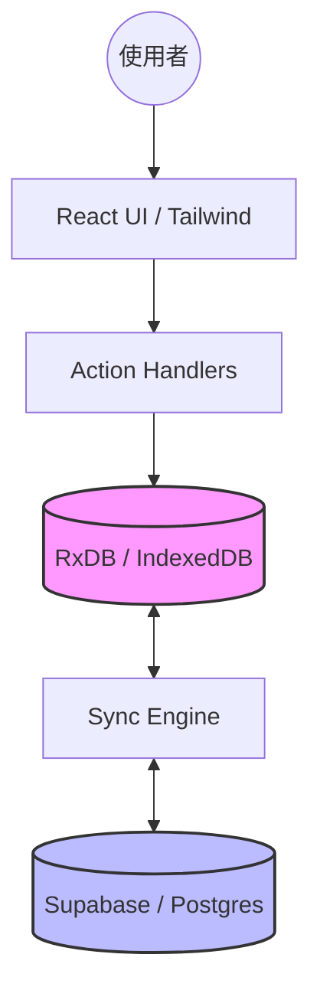

系統架構採用 **離線優先 (Offline-first)** 模式，透過 RxDB 作為中介層，確保在任何網路環境下都能保持極速響應。

```mermaid
graph TD
  User((使用者)) --> UI[React UI / Tailwind]
  UI --> Logic[Action Handlers]
  Logic --> LocalDB[(RxDB / IndexedDB)]
  LocalDB <--> Sync[Sync Engine]
  Sync <--> Cloud[(Supabase / Postgres)]
  
  style LocalDB fill:#f9f,stroke:#333,stroke-width:2px
  style Cloud fill:#bbf,stroke:#333,stroke-width:2px
```
